# Large Language Models: A Comprehensive Guide 🤖

## Table of Contents 📑
1. [Basics Foundation](#basics-foundation)
2. [Architecture Deep Dive](#architecture-deep-dive)
3. [Learnability & Training](#learnability--training)
4. [User Acceptability](#user-acceptability)
5. [Ethics & Advanced Concepts](#ethics--advanced-concepts)
6. [Prerequisites & Requirements](#prerequisites--requirements)

## Basics Foundation 🎓

### Introduction to Natural Language Processing
- **Core Concepts**: Understanding human language computation, tokenization, parsing, and semantic analysis
- **Historical Evolution**: From rule-based systems to statistical methods to neural approaches
- **Key Challenges**: Ambiguity, context-dependency, and multilingual processing

### Language Models Fundamentals
```python
# Basic N-gram Language Model Example
def ngram_probability(text, n):
    tokens = tokenize(text)
    ngrams = create_ngrams(tokens, n)
    return calculate_probability(ngrams)
```

### Word Embeddings
| Method | Description | Key Features |
|--------|-------------|--------------|
| Word2Vec | Neural network-based embedding | Context prediction |
| GloVE | Statistical embedding | Global matrix factorization |

## Architecture Deep Dive 🏗️

### Transformer Architecture
```markdown
Components:
1. Multi-head Self-attention
2. Feed-forward Networks
3. Layer Normalization
4. Positional Encoding
```

### Model Types
- **Decoder-only**: GPT family, focused on text generation
- **Encoder-only**: BERT, specialized in understanding
- **Encoder-decoder**: T5, versatile for various tasks

### Advanced Attention Mechanisms
- **Multi-query Attention**
- **Grouped-query Attention**
- **Sparse Attention Patterns**

## Learnability & Training 📈

### Scaling Laws
- **Compute Optimal Training**
- **Model Size vs. Data Size**
- **Performance Scaling Curves**

### Fine-tuning Approaches
```python
# Basic Instruction Fine-tuning
def instruction_finetune(model, dataset):
    for batch in dataset:
        loss = model.train_step(
            input=batch.instruction,
            target=batch.response
        )
```

### Efficient Training
- **Parameter-Efficient Fine-Tuning (PEFT)**
- **LoRA and QLoRA**
- **Distillation Techniques**

## User Acceptability 🎯

### Retrieval-Augmented Generation (RAG)
```markdown
RAG Architecture:
1. Document Retrieval
2. Context Integration
3. Enhanced Generation
```

### Multimodal Capabilities
- **Vision-Language Integration**
- **Cross-modal Understanding**
- **Multimodal Reasoning**

### Tool Integration
- **API Calling**
- **Code Execution**
- **External Tool Usage**

## Ethics & Advanced Concepts ⚖️

### Ethical Considerations
- **Bias Mitigation**
- **Toxicity Control**
- **Hallucination Prevention**

### Beyond Transformers
```markdown
Future Directions:
- State Space Models
- Continuous Time Models
- Neural ODEs
```

## Prerequisites & Requirements 📚

### Mandatory Skills
1. **Data Structures & Algorithms**
   - Complexity Analysis
   - Graph Algorithms
   - Dynamic Programming

2. **Machine Learning**
   - Statistical Learning
   - Optimization Methods
   - Model Evaluation

### Desirable Skills
1. **NLP Fundamentals**
   - Text Processing
   - Linguistic Theory
   - Information Extraction

2. **Deep Learning**
   - Neural Network Architectures
   - Backpropagation
   - Optimization Techniques

3. **Python Programming**
```python
# Essential Python Skills
def demonstrate_skills():
    # Data Processing
    import pandas as pd
    import numpy as np
    
    # Deep Learning
    import torch
    import tensorflow
    
    # NLP Tools
    import transformers
    import spacy
```

> 💡 **Note**: This course content requires continuous updating due to the rapid advancement in the field of Large Language Models.

---
*For optimal learning experience, ensure you have a strong foundation in the prerequisite subjects before diving into advanced LLM concepts.*

# Understanding Language Models (LMs) 🤖

## Core Concepts 📚

### Definition
A Language Model (LM) is a probabilistic model that computes the probability distribution over sequences of tokens in a given vocabulary.

### Mathematical Foundation
Given a vocabulary V = {arrived, delhi, have, is, monsoon, rains, the}

```python
# Example probability calculations
P(the monsoon rains have arrived) > P(monsoon the have rains arrived)
# Second sequence is less probable due to incorrect grammar
```

## Probability Calculation 📊

### Chain Rule Implementation
For a sequence X₁:L = {X₁, X₂, ..., XL}:

```markdown
P(x₁:L) = P(x₁) · P(x₂|x₁) · P(x₃|x₁,x₂) ... P(xL|x₁:L-1)
        = ∏ᶦ₌₁ᴸ P(xᵢ|x₁:ᵢ₋₁)
```

### Example Breakdown
For input "the monsoon rains have":
1. Model calculates P(xᵢ | the monsoon rains have) for all xᵢ ∈ V
2. Next token is sampled from this distribution
3. Process continues auto-regressively

## Modern LM Architecture 🏗️

### Deep Neural Networks
```markdown
Input: "the monsoon rains have"
Output: Probability distribution over V
Process: Efficient auto-regressive calculation
```

## Scale and Evolution 📈

### Model Size Growth
| Year | Model | Parameters |
|------|--------|------------|
| 2020 | GPT-3 | 175B |
| 2022 | PaLM | 540B |
| 2023 | GPT-4* | ~1.76T |
| 2023 | Gemini-Ultra* | ~1.56T |

> *Note: Parameter counts for GPT-4 and Gemini-Ultra are unofficial estimates

### Notable Models
- 🌟 PaLM: 540B parameters
- 🌍 BLOOM: 176B parameters
- 🔄 OPT: 175B parameters

### Growth Metrics
- 5000x increase in model size over 4 years
- Exponential growth in training dataset size
- Continuous improvement in performance

## Visual Representation 📊


### Key Components
1. **Input Processing**: Tokenization of text
2. **Computation**: Deep neural network processing
3. **Output**: Probability distribution over vocabulary
4. **Generation**: Sampling and token selection

## Technical Implementation 💻

```python
class LanguageModel:
    def __init__(self, vocabulary):
        self.vocab = vocabulary
        
    def calculate_probability(self, sequence):
        """
        Calculate probability of token sequence
        """
        probability = 1.0
        for i in range(len(sequence)):
            context = sequence[:i]
            next_token = sequence[i]
            probability *= self.token_probability(next_token, context)
        return probability
```

---
> 💡 **Important**: The field of Language Models is rapidly evolving, with new architectures and larger models being developed continuously. Parameter counts for proprietary models should be considered estimates unless officially confirmed.

# LLMs in the AI Landscape: A Hierarchical Overview 🌟

## The AI Hierarchy 🔺


## Detailed Breakdown 📊

### 1. Artificial Intelligence (AI) 🤖
- **Definition**: Systems exhibiting human-like intelligence
- **Scope**: Broadest category encompassing all intelligent systems
- **Goal**: Emulate human cognitive functions

### 2. Machine Learning (ML) 📈
```python
class MachineLearning:
    """Base class for learning systems"""
    def learn_from_data(self, data):
        # Algorithms that learn rules automatically
        pass
```

| Feature | Description |
|---------|-------------|
| Learning Type | Automatic from data |
| Supervision | Supervised/Unsupervised |
| Output | Learned patterns & rules |

### 3. Deep Learning 🧠

#### Key Components
```markdown
- Neural Networks
- Multiple Layers
- Complex Pattern Recognition
- Hierarchical Feature Learning
```

#### Architecture Overview
```python
class DeepNeuralNetwork:
    def __init__(self):
        self.layers = [
            Layer("Input"),
            Layer("Hidden1"),
            Layer("Hidden2"),
            Layer("Output")
        ]
```

### 4. Large Language Models 📚

#### Characteristics
- **Architecture**: Deep neural networks specialized for text
- **Capabilities**:
  - Text parsing
  - Natural language understanding
  - Human-like text generation

#### Technical Framework
```python
class LargeLanguageModel(DeepNeuralNetwork):
    def process_text(self, input_text):
        tokens = self.tokenize(input_text)
        embeddings = self.encode(tokens)
        return self.generate_response(embeddings)
```

### 5. Generative AI (GenAI) 🎨

#### Multi-Modal Capabilities
| Content Type | Examples |
|--------------|----------|
| Text | Stories, code, articles |
| Images | Art, designs, photos |
| Media | Music, videos, animations |

## Integration and Relationships 🔄

### Hierarchical Flow
1. **AI** provides the foundational principles
2. **ML** implements learning from data
3. **Deep Learning** adds neural network complexity
4. **LLMs** specialize in language processing
5. **GenAI** extends to content creation

## Technical Implementation Example 💻

```python
class AISystem:
    def __init__(self):
        self.ml_engine = MachineLearning()
        self.deep_net = DeepNeuralNetwork()
        self.llm = LargeLanguageModel()
        self.gen_ai = GenerativeAI()

    def process_input(self, data):
        # Hierarchical processing through layers
        ml_output = self.ml_engine.process(data)
        deep_features = self.deep_net.extract_features(ml_output)
        language_understanding = self.llm.comprehend(deep_features)
        generated_content = self.gen_ai.create(language_understanding)
        return generated_content
```

## Visual Summary 📊


---
> 💡 **Key Insight**: Each layer in the AI hierarchy builds upon and enhances the capabilities of the previous layers, culminating in sophisticated generative systems.

# AI and LLMs: A Hierarchical Overview 🌐

## AI Landscape Hierarchy 📊


## Detailed Breakdown 🔍

### 1. Artificial Intelligence (AI) 🤖
- **Definition**: Systems exhibiting human-like intelligence
- **Scope**: Broadest category encompassing all intelligent systems
- **Goal**: Emulate human cognitive functions

### 2. Machine Learning (ML) 📚

```python
class MachineLearning:
    def learn_from_data(self, data):
        """Automatically learn patterns from data"""
        patterns = extract_patterns(data)
        rules = generate_rules(patterns)
        return rules
```

| Characteristic | Description |
|----------------|-------------|
| Learning Type | Automatic |
| Data Dependency | High |
| Rule Generation | Self-learned |

### 3. Deep Learning 🧠

#### Key Components
- Multi-layer neural networks
- Complex pattern recognition
- Hierarchical feature learning

```markdown
Architecture Layers:
1. Input Layer
2. Multiple Hidden Layers
3. Output Layer
```

### 4. Large Language Models (LLMs) 💬

#### Characteristics
- **Architecture**: Deep neural networks
- **Purpose**: Text parsing and generation
- **Scale**: Billions to trillions of parameters

```python
class LargeLanguageModel:
    def __init__(self, parameters):
        self.layers = build_transformer_layers(parameters)
        
    def process_text(self, input_text):
        embeddings = self.encode(input_text)
        return self.generate_response(embeddings)
```

### 5. Generative AI (GenAI) 🎨

#### Capabilities
1. **Text Generation**
   - Stories
   - Articles
   - Code

2. **Media Creation**
   - Images
   - Audio
   - Video

## Technical Implementation Details ⚙️

### Neural Network Architecture

```markdown
Input Layer
    ↓
Hidden Layers
    ↓
Transformer Blocks
    ↓
Output Layer
```

### Processing Pipeline
1. **Input Processing**
   - Tokenization
   - Embedding

2. **Feature Extraction**
   - Pattern Recognition
   - Context Understanding

3. **Output Generation**
   - Token Prediction
   - Response Formation

## Visual Representation 📈


## Comparative Analysis 📊

| Level | Scope | Primary Function |
|-------|-------|-----------------|
| AI | Broadest | Intelligence Simulation |
| ML | Wide | Pattern Learning |
| DL | Specialized | Feature Extraction |
| LLM | Focused | Text Processing |
| GenAI | Creative | Content Generation |

---

> 💡 **Key Insight**: The progression from AI to LLMs represents increasing specialization and capability in specific domains, particularly in natural language processing and generation.

# Evolution of Language Models: A Historical Timeline 📚

## Pre-1990s Era: Early Foundations 🌱

### 1966: ELIZA - The Pioneer
- **Developer**: Joseph Weizenbaum at MIT
- **Innovation**: First natural language processing system
- **Capability**: Basic conversation simulation
```python
# Conceptual ELIZA Implementation
def eliza_response(user_input):
    pattern = find_matching_pattern(user_input)
    return generate_response(pattern)
```

### 1972: STNLP - Statistical Revolution
- **Creator**: Terry Winograd (MIT)
- **Breakthrough**: First statistical approach to NLP
- **Impact**: Laid foundation for modern statistical NLP

## 1990s: Neural Networks Emerge 🧠

### 1997: LSTM Networks

- **Inventors**: Hochreiter & Schmidhuber
- **Innovation**: Long-term memory capabilities
- **Application**: Sequential data processing

### 1999: IBM Model 1
- **Purpose**: Statistical machine translation
- **Features**: First probabilistic translation model
- **Impact**: Revolutionary approach to machine translation

## 2000s: Hardware Revolution 💻

### 2000: NVIDIA GPU
| Innovation | Impact |
|------------|---------|
| GeForce 256 | First GPU |
| Parallel Processing | Enabled deep learning |
| CUDA Platform | AI acceleration |

## 2010s: Deep Learning Era 🚀

### 2013-2015: Major Institutional Developments
1. **Google Brain** (2013)
   - Focus: Deep learning research
   - Applications: Natural language processing

2. **Facebook AI Research (FAIR)** (2014)
   - Mission: Advanced AI research
   - Contributions: PyTorch, FastText

3. **OpenAI** (2015)
   - Goal: AGI development
   - Impact: Democratizing AI research

### 2016-2017: Technical Breakthroughs

#### Google TPUs (2016)
```markdown
Advantages:
- Custom AI acceleration
- Optimized for neural networks
- Enhanced training capabilities
```

#### Transformer Architecture (2017)
```python
class TransformerModel:
    def __init__(self):
        self.attention = MultiHeadAttention()
        self.ffn = FeedForward()
        
    def forward(self, input_seq):
        attention_output = self.attention(input_seq)
        return self.ffn(attention_output)
```

## Timeline Visualization 📅


## Impact Analysis 📊

### Key Developments by Decade
| Period | Major Innovation | Impact |
|--------|-----------------|---------|
| 1960s | Rule-based systems | Foundation |
| 1970s | Statistical approaches | Methodology |
| 1990s | Neural networks | Architecture |
| 2000s | Hardware acceleration | Scale |
| 2010s | Deep learning | Revolution |

---

> 💡 **Historical Context**: The evolution of LLMs represents a shift from rule-based systems to statistical models, and finally to deep learning architectures, enabled by advances in both algorithms and hardware.

# Evolution of Language Models: A Historical Timeline 📚

## 1960s - Early Foundations 🌱

### 1966: ELIZA - The Pioneer
```markdown
Developer: Joseph Weizenbaum (MIT)
Achievement: First natural language processing program
Capability: Basic conversation simulation through pattern matching
```

## 1970s - Statistical Beginnings 📊

### 1972: STNLP System
- **Developer**: Terry Winograd (MIT)
- **Innovation**: Statistical rules for text generation
- **Impact**: Laid groundwork for statistical NLP

## 1990s - Hardware & Statistical Breakthroughs 🔧

### Key Developments
| Year | Innovation | Impact |
|------|------------|---------|
| 1997 | LSTM Networks | Revolutionary memory architecture |
| 1999 | NVIDIA GPU | Enabled parallel processing |
| 1999 | IBM Model 1 | Statistical machine translation |

## 2000s - Corporate Innovation 🏢

### Major Milestones


## 2010s - Transformer Revolution ⚡

### 2017: Transformer Architecture
- **Paper**: "Attention Is All You Need" (Vaswani et al.)
- **Innovation**: Self-attention mechanism
- **Impact**: Foundation for modern LLMs

### Key Infrastructure
1. **Google TPUs** (2016)
   - Purpose-built AI accelerators
   - Enhanced training capabilities

2. **Stanford SQuAD** (2016)
   - Comprehensive QA dataset
   - Benchmark for NLP systems

## Technical Evolution Visualization 📈


## Architectural Progression 🏗️

### Early Systems (1960s-1990s)
```python
class EarlyNLP:
    def process(self, input_text):
        return pattern_match(input_text, rules_database)
```

### Modern Architecture (2017+)
```python
class TransformerModel:
    def __init__(self):
        self.attention_layers = MultiHeadAttention()
        self.feed_forward = FeedForward()
    
    def process(self, input_text):
        embeddings = self.encode(input_text)
        attention = self.attention_layers(embeddings)
        return self.generate(attention)
```

## Impact Analysis 📊

| Era | Primary Focus | Key Technology |
|-----|--------------|----------------|
| 1960s | Rule-based | Pattern Matching |
| 1970s | Statistical | Probability Models |
| 1990s | Neural | LSTM Networks |
| 2000s | Deep Learning | Neural Networks |
| 2010s | Attention | Transformers |

---

> 💡 **Key Insight**: The evolution of LLMs represents a shift from rule-based systems to statistical models, and finally to neural architectures with attention mechanisms.

## Resources & References 📚
- Vaswani et al. (2017): "Attention Is All You Need"
- Hochreiter & Schmidhuber (1997): LSTM paper
- Stanford NLP Group publications

*This timeline represents major milestones in LLM development, showcasing the rapid progression from simple pattern matching to sophisticated neural architectures.*

# GPT Evolution: OpenAI's Language Model Journey 🚀

## GPT (2018) - The Foundation 🌱

### Core Paper Details
```markdown
Title: "Improving Language Understanding by Generative Pre-Training"
Authors:
- Alec Radford
- Karthik Narasimhan
- Tim Salimans
- Ilya Sutskever
```

### Key Innovations 🔬
1. **Decoder-Only Architecture**
   - Simplified yet powerful approach
   - Focused on text generation
   
2. **Generative Pre-training**
   ```python
   class GPT:
       def __init__(self):
           self.params = 117_000_000  # 117M parameters
           self.context_length = 512
   ```

## GPT-2 (2019) - Scaling Up 📈

### Paper Information
```markdown
Title: "Language Models are Unsupervised Multitask Learners"
Authors:
- Alec Radford
- Jeffrey Wu
- Rewon Child
- David Luan
- Dario Amodei
- Ilya Sutskever
```

### Technical Advancements 🔧

| Feature | GPT-1 | GPT-2 | Improvement |
|---------|-------|-------|-------------|
| Parameters | 117M | 1.5B | 13x increase |
| Context Length | 512 | 1024 | 2x increase |
| Architecture | Base | Enhanced | LayerNorm additions |

### Architectural Changes


## Technical Deep Dive ⚙️

### Model Scaling
```python
class ModelComparison:
    def __init__(self):
        self.gpt1 = {
            "parameters": "117M",
            "context_length": 512,
            "architecture": "decoder-only"
        }
        
        self.gpt2 = {
            "parameters": "1.5B",
            "context_length": 1024,
            "architecture": "enhanced-decoder"
        }
```

### Key Improvements 📊

1. **Parameter Scaling**
   - 13x increase in model capacity
   - Enhanced learning capabilities
   - Improved generalization

2. **Context Length**
   ```markdown
   GPT-1: 512 tokens
       ↓ (2x increase)
   GPT-2: 1024 tokens
   ```

3. **Architecture Refinements**
   - LayerNorm placement optimization
   - Modified weight initialization
   - Enhanced stability during training

## Visual Comparison 📈

```mermaid
graph LR
    A[GPT-1 117M] -->|13x scale| B[GPT-2 1.5B]
    A -->|2x context| C[512 → 1024]
    A -->|Architecture| D[Enhanced LayerNorm]
```



## Impact Analysis 🎯

### Achievements
1. **Scale Demonstration**
   - Proved viability of larger models
   - Set foundation for future scaling

2. **Architectural Validation**
   - Confirmed decoder-only approach
   - Established pre-training effectiveness

3. **Performance Gains**
   - Improved text generation quality
   - Enhanced context understanding

---

> 💡 **Key Insight**: The evolution from GPT to GPT-2 demonstrated that scaling model size and context length, while maintaining architectural simplicity, leads to significant performance improvements.

## Citations 📚
```markdown
@article{radford2018improving,
  title={Improving Language Understanding by Generative Pre-Training},
  author={Radford, A. and Narasimhan, K. and Salimans, T. and Sutskever, I.},
  year={2018}
}

@article{radford2019language,
  title={Language Models are Unsupervised Multitask Learners},
  author={Radford, A. and Wu, J. and Child, R. and Luan, D. and Amodei, D. and Sutskever, I.},
  year={2019}
}
```

# Analysis of GPT-2 Scaling Effects: Performance Metrics 📊

## Chart Interpretation Overview

The provided visualizations appear to be from a 2019 study examining GPT-2's performance scaling across different model sizes and tasks. Let me break this down systematically.

### 🔍 Model Sizes Analyzed
- 117M parameters
- 345M parameters
- 762M parameters
- 1542M parameters

## 📈 Performance Across Tasks

### 1. Reading Comprehension
* Performance scale: 30-90 points
* Notable observations:
  - DrQA+PGNet achieves ~80 points
  - DrQA alone performs at ~50 points
  - PGNet shows intermediate performance
  - Seq2seq baseline performs at lower range

### 2. Translation Performance
* Scale: 5-25 points
* Key methods observed:
  - Unsupervised Statistical MT (~20 points)
  - Denoising + Backtranslation
  - Embedding Nearest Neighbor
  - Basic Denoising

### 3. Question Answering
* Performance metrics: 15-32 points
* Systems evaluated:
  - Open Domain QA systems
  - Seq2seq + Attention
  - Most frequent Q-type answer baseline

## 🎯 Key Insights

1. **Scaling Effect**
   * Larger models consistently show better performance
   * The improvement appears logarithmic rather than linear
   * Most dramatic improvements seen between 117M and 762M parameters

2. **Task-Specific Patterns**
   * Reading comprehension shows the most dramatic improvements with scale
   * Translation benefits moderately from increased model size
   * Question answering shows consistent but modest gains

## 📊 Comparative Analysis

The results demonstrate a clear correlation between model size and performance, though with diminishing returns at larger scales. The most significant jumps in performance appear to occur in the transition from 117M to 345M parameters.

Would you like me to elaborate on any specific aspect of these results or provide a deeper analysis of a particular task's scaling behavior?

# Evolution of Large Language Models (2019-2022) 📚

## Timeline Analysis 🗓️

### 2019: The Foundation Year
#### Google T5
- **Project**: Text-to-Text Transfer Transformer (T5)
- **Innovation**: Unified approach to NLP tasks
- **Key Feature**: All NLP tasks framed as text-to-text problems

#### OpenAI GPT-2
- **Scale**: Multiple variants (117M → 1.5B parameters)
- **Impact**: Set new benchmarks for language modeling
- **Focus**: Zero-shot task adaptation

### 2020: The Scaling Revolution 📈
#### OpenAI GPT-3
- **Scale**: 175B parameters
- **Breakthrough**: Few-shot learning capabilities
- **Impact**: Demonstrated emergent abilities at scale

### 2021-2022: The Multi-Player Era 🌟

#### Google's Response
##### PaLM
- **Scale**: 540B parameters
- **Architecture**: Pathways system
- **Features**:
  - Reasoning capabilities
  - Multilingual proficiency
  - Code generation

##### Other Google Projects
- **LaMDA**: Conversation-focused model
- **MINERVA**: Specialized for quantitative reasoning
- **GLaM**: Mixture-of-experts approach

#### Industry-Wide Competition

| Organization | Model | Key Focus |
|--------------|-------|-----------|
| Microsoft/NVIDIA | Megatron-Turing NLG | Scale + Efficiency |
| DeepMind | Gopher & Chinchilla | Optimal scaling laws |
| OpenAI | Codex | Code generation |

## Meta's Position 🎯

Meta (formerly Facebook) was actively involved but took a different approach:
- **Focus**: Multiple smaller, specialized models
- **Strategy**: Emphasis on open-source contributions
- **Projects**: 
  - OPT (Open Pretrained Transformer)
  - BERT derivatives
  - Multilingual models

## Key Trends & Insights 💡

### 1. Scaling Patterns
- Initial focus on parameter count
- Later shift to computational efficiency
- Emergence of optimal scaling laws

### 2. Specialization vs Generalization


### 3. Competition Dynamics
- OpenAI: First-mover advantage
- Google: Infrastructure strength
- Meta: Open-source strategy
- Microsoft: Partnership approach

## Impact on AI Landscape 🌍

1. **Research Direction**
   - Shift from architecture to scale
   - Focus on efficiency and optimization
   - Emergence of specialized applications

2. **Industry Dynamics**
   - Increased competition
   - Resource requirements
   - Collaboration patterns

Would you like me to elaborate on any specific aspect of this evolution or dive deeper into particular models' architectures?

# 2023: A Landmark Year in AI Development 🚀

## Timeline Analysis & Key Developments 📊

### Q1 2023: Foundation Models Emerge
- **February: Google's Bard Launch** 🔍
  Released as Google's answer to ChatGPT, marking their first public-facing conversational AI model. This release represented Google's strategic move to maintain competitiveness in the AI space.

- **February: Meta's LLaMA Release** 📚
  Meta's introduction of the LLaMA family as open-source models marked a significant shift toward democratizing AI development, enabling researchers and developers to build upon foundation models.

- **March: GPT-4 Revolution** ⚡
  OpenAI's GPT-4 release demonstrated remarkable improvements in reasoning, creativity, and task completion capabilities, setting new benchmarks for large language model performance.

- **March: Claude Enters the Arena** 🎯
  Anthropic's release of Claude introduced a new approach to AI safety and alignment, bringing sophisticated capabilities with a focus on helpful and honest interactions.

### Q3-Q4 2023: Innovation Acceleration

- **September: Mistral AI Emergence** 🌟
  The release of Mistral-7B showcased impressive performance despite its relatively smaller size, challenging assumptions about model scaling and efficiency.

- **November: xAI's Grok Launch** 🤖
  xAI's entry into the AI space with Grok represented a new competitor focusing on personality-driven AI interactions with real-time data access.

- **December: Google's Gemini Debut** 💫
  Ending the year with Gemini's release, Google demonstrated their continued innovation in multimodal AI capabilities and performance optimization.

## Impact Analysis 🎯

### Key Trends
1. **Open Source Movement** 📘
   - Meta's LLaMA and Mistral AI's releases accelerated open-source AI development
   - Created new opportunities for innovation and collaboration

2. **Competition Intensification** ⚔️
   - Multiple major tech companies entered the AI race
   - Drove rapid advancement in capabilities and features

3. **Architectural Innovation** 🏗️
   - Varied approaches to model architecture and training
   - Focus on efficiency and performance optimization

### Industry Implications


## Looking Forward 🔮

This transformative year established the foundation for:
- Continued innovation in model architectures
- Enhanced focus on AI safety and alignment
- Greater accessibility and democratization of AI technology
- Accelerated development of specialized AI applications

*Note: This timeline represents major public releases and may not include all developments in the field during 2023.*

# 2024: The Evolution Continues in AI 🚀

## Q1 2024 Major Releases & Developments 🌟

### Codestral 🧬
- Revolutionary advancement in code understanding and generation
- Built upon previous foundations while introducing novel architectural improvements
- Demonstrates enhanced ability to handle complex programming tasks and technical reasoning

### Meta's Llama 3 🦙
- Significant leap forward in Meta's open-source AI journey
- Improved performance metrics across various benchmarks
- Enhanced multilingual capabilities and contextual understanding
- Continues Meta's commitment to open-source AI development

### Gemma 2 💎


### GPT-4.0 🧠
Building upon GPT-4's foundation with:
- Advanced reasoning capabilities
- Improved factual accuracy
- Enhanced specialized domain expertise
- More nuanced understanding of context and intent

## Technical Evolution Analysis 📊

### Architecture Innovations
| Model | Key Features | Notable Improvements |
|-------|--------------|---------------------|
| Codestral | Code Specialization | Advanced Programming Logic |
| Llama 3 | Open Architecture | Enhanced Efficiency |
| Gemma 2 | Multimodal Processing | Improved Integration |
| GPT-4.0 | Advanced Reasoning | Refined Context Understanding |

### Industry Impact Assessment 🎯

```markdown
📈 Market Dynamics
- Increased competition driving innovation
- Faster development cycles
- Greater focus on specialized applications
```

## Emerging Trends 🌈

### 1. Specialization
- Models optimized for specific domains
- Enhanced performance in targeted tasks
- Custom architectures for unique use cases

### 2. Efficiency
- Improved parameter utilization
- Reduced computational requirements
- Better resource optimization

### 3. Integration
- Seamless multimodal capabilities
- Enhanced cross-domain understanding
- Improved system interoperability

## Looking Forward 🔮

### Near-Term Expectations
- Further specialization of AI models
- Increased focus on efficiency and optimization
- Enhanced real-world application integration
- Continued emphasis on responsible AI development

---

> 💡 **Note**: The AI landscape continues to evolve rapidly, with new developments emerging regularly. This overview represents major public releases and notable advancements in early 2024.

# Understanding the Significance of LLM-Specific Courses 🎓

## Why A Dedicated Course? 🤔

### Traditional ML vs LLM Paradigm
The emergence of Large Language Models (LLMs) represents a fundamental shift in AI that warrants dedicated study:

**1. Scale-Driven Phenomena** 
- Traditional ML models show linear improvements with scale
- LLMs exhibit **emergent capabilities** that appear suddenly at certain scale thresholds
- New behaviors cannot be predicted from smaller-scale models

### Emergent Properties 🌟

**Qualitative Changes:**
```markdown
Small Models:
- Basic pattern recognition
- Limited task-specific abilities
- Explicit training required

Large Models:
- Zero/few-shot learning
- Task generalization
- Complex reasoning
- Natural language interaction
```

## Scale-Driven Transformations 📈

### 1. Architectural Impact
While the fundamental architecture (transformers) remains similar, scaling introduces:
- Different optimization challenges
- Novel training techniques
- Unique infrastructure requirements

### 2. Capability Jumps
**Key Emergent Abilities:**
- In-context learning
- Chain-of-thought reasoning
- Instruction following
- Multi-modal understanding
- Task composition

## Societal Implications 🌍

### New Considerations
1. **Ethics & Safety**
   - Novel safety concerns
   - Alignment challenges
   - Societal impact assessment

2. **Application Paradigms**
   - Prompt engineering
   - System design
   - Integration patterns

### Technical Depth Required
The course needs to cover:
- Scaling laws
- Training dynamics
- Emergence theories
- Safety mechanisms
- Evaluation frameworks

## Course Justification Summary 📚

This dedicated course is essential because:
1. Traditional ML courses don't adequately cover emergence phenomena
2. Scale-specific challenges require specialized knowledge
3. Societal impacts demand careful study
4. Novel evaluation and safety frameworks are needed
5. Understanding emergence is crucial for future development

The field represents a paradigm shift that merits its own academic focus, combining technical depth with broader implications for society and AI development.

# Understanding LLM Emergence & Impact 🚀

## 1. Emergent Capabilities 🌟

### In-Context Learning Revolution


### Key Distinctions
| Feature | Traditional Models | Large Language Models |
|---------|-------------------|----------------------|
| Training | Task-specific fine-tuning | General pre-training |
| Adaptation | Requires retraining | Prompt-based guidance |
| Flexibility | Limited to trained tasks | Dynamic task adaptation |
| Scale Impact | Linear improvements | Emergent capabilities |

## 2. Real-World Applications 🌍

### Research Impact
```markdown
State-of-the-Art Achievements:
- 📊 Sentiment Classification
- ❓ Question Answering
- 📝 Text Summarization
- 🔄 Machine Translation
```

### Industry Transformation
- **Development Workflow**
  - Rapid prototyping
  - Code assistance
  - Documentation generation

- **Content Creation**
  - Automated writing
  - Creative assistance
  - Content optimization

## 3. Course Significance 📚

### Educational Value
- **Theoretical Understanding**
  ```python
  # Example of emergence concept
  def demonstrate_emergence(model_size):
      if model_size < threshold:
          return "Basic pattern recognition"
      else:
          return "Complex reasoning & adaptation"
  ```

- **Practical Applications**
  - Prompt engineering techniques
  - System integration patterns
  - Evaluation frameworks

### Research Implications 🔬
1. **Methodology Evolution**
   - New evaluation metrics
   - Novel testing approaches
   - Emergence study methods

2. **Future Directions**
   - Scaling laws investigation
   - Architecture optimization
   - Safety considerations

## 4. Core Learning Objectives 🎯

### Technical Mastery
- Understanding scaling laws
- Emergence mechanisms
- Architectural considerations

### Practical Skills
- Prompt engineering
- System design
- Performance optimization

### Ethical Considerations
- Responsible deployment
- Bias mitigation
- Safety protocols

## Summary & Outlook 🔮

The course exists to bridge the gap between:
1. Traditional ML knowledge
2. Emergent LLM capabilities
3. Real-world applications
4. Research methodologies

> *"Understanding emergence in LLMs is crucial for advancing AI technology while ensuring responsible development and deployment."*

# Understanding LLM Risks & Challenges 🔍

## Core Challenges in LLM Implementation 

### 1. Reliability & Hallucination Risk 🎯
Large Language Models face significant challenges in maintaining factual accuracy:


### 2. Social Bias & Fairness ⚖️

LLMs can perpetuate and amplify existing societal biases:

| Bias Type | Example | Impact |
|-----------|---------|---------|
| Gender Bias | P(He is a doctor) > P(She is a doctor) | Reinforces professional stereotypes |
| Cultural Bias | Western-centric responses | Limited multicultural understanding |
| Representation Bias | Skewed demographic predictions | Unfair treatment of minorities |

### 3. Content Toxicity 🚫

**Key Concerns:**
- Training data includes problematic content from sources like Reddit
- Potential for generating harmful or offensive responses
- Challenges in content filtering and moderation

```python
# Conceptual example of toxicity filtering
def filter_content(llm_response):
    toxicity_score = analyze_toxicity(llm_response)
    if toxicity_score > THRESHOLD:
        return sanitize_response(llm_response)
    return llm_response
```

### 4. Security Vulnerabilities 🔒

**Data Poisoning Risks:**
- Training data vulnerability through public internet scraping
- Potential for malicious data injection
- Need for robust security measures

## Why This Course Matters 🎓

This course exists to address these critical challenges:

1. **Safety Implementation**: Learning to build safeguards against these risks
2. **Ethical Development**: Understanding responsible AI development
3. **Technical Solutions**: Developing methods to mitigate these challenges
4. **Real-world Impact**: Preparing for practical applications while maintaining safety

### Future Considerations 🔮


## Best Practices & Mitigation Strategies 🛡️

1. **Regular Model Evaluation**
2. **Bias Detection Systems**
3. **Content Filtering Mechanisms**
4. **Security Auditing**

> Understanding these challenges is crucial for developing and implementing LLMs responsibly in real-world applications.

# Neural NLP and Language Models: A Comprehensive Overview 🧠

## Module 1: Foundations of Modern NLP 📚

### 1. The Evolution of NLP 🔄
Let's explore the journey from traditional NLP to neural approaches:

#### Traditional NLP Foundations
- **Rule-Based Systems**: Hand-crafted rules for language processing
- **Statistical Methods**: Probabilistic models and n-grams
- **Feature Engineering**: Manual creation of linguistic features

#### Transition to Neural NLP


### 2. Language Modeling Fundamentals 📊

#### Core Concepts
| Concept | Description | Application |
|---------|-------------|-------------|
| Probability Distribution | P(word₍ₜ₎\|word₍₁₎...word₍ₜ₋₁₎) | Next word prediction |
| Context Window | n previous tokens | Determines model capacity |
| Vocabulary | Tokenized word space | Model's language coverage |

### 3. Word Embeddings Revolution 🌟

#### Key Approaches
```python
# Word2Vec Example (Skip-gram)
def skip_gram(center_word, context_words):
    # Transform words into dense vectors
    v_c = embed_matrix[center_word]
    v_o = embed_matrix[context_words]
    return compute_probability(v_c, v_o)
```

#### Embedding Types
- **Word2Vec**: 
  - CBOW (Continuous Bag of Words)
  - Skip-gram architecture
- **GloVe**: 
  - Global matrix factorization
  - Local context window methods

### 4. Neural Language Models Architecture 🏗️

#### Sequential Evolution
1. **CNN-based Models**
   - Local feature extraction
   - Parallel processing capability

2. **RNN Architectures**
   - Sequential processing
   - Long-term dependencies
   ```python
   class SimpleRNN:
       def forward(self, x_t, h_t_1):
           return tanh(W_x @ x_t + W_h @ h_t_1)
   ```

3. **Seq2Seq Models**
   - Encoder-decoder architecture
   - Machine translation breakthrough

4. **Attention Mechanisms**
   - Self-attention computation
   - Multi-head attention layers

## Learning Path Progression 📈


### Key Takeaways 💡
1. Neural NLP represents a paradigm shift from discrete to continuous representations
2. Word embeddings capture semantic relationships in vector space
3. Architecture evolution: CNN → RNN → Seq2Seq → Attention
4. Each advancement addressed specific limitations of previous approaches

Would you like me to elaborate on any particular aspect of this overview?

# Modern Transformer Architectures and Techniques 🚀

## Module 2: Advanced Architecture Deep Dive 

### 1. Vanilla Transformer Architecture Blueprint 🏗️


### 2. Transformer Variants Comparison 📊

| Architecture Type | Key Features | Primary Use Cases | Examples |
|------------------|--------------|-------------------|-----------|
| **Encoder-only** | Bi-directional context, MASK tokens | Understanding, Classification | BERT, RoBERTa |
| **Decoder-only** | Auto-regressive, Left-to-right | Text Generation | GPT, LLaMA |
| **Encoder-decoder** | Source-target mapping | Translation, Summarization | T5, BART |
| **Prefix LM** | Flexible context handling | Hybrid tasks | PaLM |

### 3. Training Strategy Differentiation 🎯

#### Masked LM (BERT-style) 
```python
# Example of BERT-style masking
text = "The cat sits on the [MASK]"
labels = ["mat"]  # Predict masked token
```

#### Auto-regressive LM (GPT-style)
```python
# Example of GPT-style prediction
input_text = "The cat sits"
next_token = "on"  # Predict next token
```

### 4. Advanced Decoding Strategies 🎲

#### Temperature-based Sampling
```python
def sample_with_temperature(logits, temperature=0.7):
    logits = logits / temperature
    probs = softmax(logits)
    return multinomial_sample(probs)
```

#### Strategies Overview
- **Greedy Decoding** ⚡
  - Always select highest probability
  - Fast but deterministic
- **Beam Search** 🌟
  - Maintain top-k hypotheses
  - Balance quality/diversity
- **Nucleus Sampling** 🎯
  - Dynamic probability threshold
  - Natural text generation

### 5. Modern LLM Innovations 💫

#### LLaMA & Mistral Improvements
1. **Architecture Optimizations**
   - RMSNorm for stability
   - Rotary positional embeddings
   - Flash attention mechanisms

2. **Scaling Techniques**
   ```python
   class FlashAttention:
       def forward(self, Q, K, V):
           # Efficient attention computation
           return block_sparse_attention(Q, K, V)
   ```

### 6. Advanced Attention Mechanisms 🔍

#### Multi-Query Attention
```mermaid
graph LR
    A[Query] --> B[Shared Keys]
    A --> C[Shared Values]
    B --> D[Attention Scores]
    C --> D
```

#### Grouped-Query Attention
- Reduced memory footprint
- Balanced efficiency/performance
- Grouped key-value sharing

### 7. Mixture of Experts (MoE) 🧠

#### Architecture
```python
class MoELayer:
    def forward(self, x):
        # Router selects experts
        expert_weights = router(x)
        # Combine expert outputs
        return sum([w * expert(x) for w, expert in zip(expert_weights, experts)])
```

#### Benefits
- **Conditional Computation** 💻
  - Only activate relevant experts
  - Efficient resource usage
- **Specialized Processing** 🎯
  - Domain-specific experts
  - Enhanced task performance

## Key Takeaways 💡

1. Modern architectures balance:
   - Computational efficiency
   - Model capacity
   - Training stability

2. Innovation focus areas:
   - Attention mechanisms
   - Routing strategies
   - Scale optimization

Would you like to explore any specific aspect in more detail? 🤔

# Modern Language Models: Core Concepts & Advancements 🚀

## Module Overview Map 🗺️

```mermaid
graph TB
    A[Module 3: Learnability] --> B[Scaling Laws]
    A --> C[In-context Learning]
    A --> D[Instruction Following]
    A --> E[Alignment]
    A --> F[Efficiency]
    
    F --> F1[Distillation]
    F --> F2[PEFT]
    F --> F3[Inference Optimization]
```

## 1. Scaling Laws & Emergence 📈

### Key Concepts
- **Power Law Relationships**: Performance metrics typically follow power laws with model size, compute, and data
- **Emergent Abilities**: Capabilities that appear suddenly at specific scale thresholds
- **Chinchilla Scaling**: Optimal balance between parameters and training tokens

### Critical Thresholds
```markdown
Small Models (< 1B params)  → Basic language understanding
Medium Models (1B-10B)     → Task generalization
Large Models (10B-100B)    → Emergent abilities
Massive Models (> 100B)    → Complex reasoning
```

## 2. In-context Learning (ICL) 🧠

### Components
- **Few-shot Learning**: Learning from examples within the prompt
- **Zero-shot Learning**: Task completion without examples
- **Prompt Engineering**: Crafting effective prompts for optimal performance

### Key Findings
| Type | Description | Example Use Case |
|------|-------------|-----------------|
| Direct | Explicit task instructions | Classification |
| Indirect | Implicit pattern recognition | Creative writing |
| Chain-of-Thought | Reasoning steps | Math problems |

## 3. Instruction Following & Alignment 🎯

### Training Approaches
- **Instruction Fine-tuning**: Training on explicit task instructions
- **RLHF (Reinforcement Learning from Human Feedback)**
  - Preference modeling
  - Reward modeling
  - Policy optimization

### Alignment Goals
- **Helpful**: Following user intentions accurately
- **Honest**: Acknowledging limitations and uncertainties
- **Harmless**: Avoiding harmful or toxic outputs

## 4. Efficiency & Production Optimization ⚡

### Distillation Techniques
```python
# Conceptual Example of Knowledge Distillation
def distill_knowledge(teacher_model, student_model, data):
    teacher_logits = teacher_model(data)
    student_loss = KL_divergence(
        student_model(data),
        soften(teacher_logits)
    )
```

### PEFT Methods
- **LoRA**: Low-rank adaptation of large language models
- **Prefix Tuning**: Optimizing prompt tokens
- **Adapter Layers**: Insertable transformation modules

### Inference Optimization
- **Quantization**: Reducing precision for faster inference
- **KV Cache**: Caching key-value pairs for efficient generation
- **Structured Pruning**: Removing unnecessary connections

## 5. Production Considerations 🛠️

### Performance Metrics
- **Latency**: Response generation time
- **Throughput**: Requests handled per second
- **Cost Efficiency**: Computing resources utilized

### Deployment Strategies
1. Model Compression
2. Batch Processing
3. Hardware Acceleration
4. Load Balancing

Would you like me to dive deeper into any of these topics? I can provide more detailed explanations of specific concepts or practical implementation details.

# Module 4: Advanced LLM Capabilities & Enhancements 🚀

## 1. Augmented Generation & Knowledge Integration 🧠

### Retrieval Augmented Generation (RAG)
- **Core Concept**: RAG enhances LLM outputs by incorporating external knowledge sources during generation, significantly improving factual accuracy and contextual relevance
- **Implementation**: Combines information retrieval systems with generative models, creating a pipeline where relevant documents are first retrieved, then used to inform the generation process

### External Tool Integration
```mermaid
graph LR
    A[LLM] --> B[Tool Caller]
    B --> C[Calculator]
    B --> D[Search API]
    B --> E[Code Executor]
    C & D & E --> F[Enhanced Response]
```

## 2. Multilingual Capabilities 🌍

### Multilingual LMs Architecture
- **Token Embedding**: Utilizes unified vocabulary across languages, enabling seamless multilingual understanding
- **Cross-lingual Transfer**: Models can transfer knowledge learned in one language to improve performance in others
- **Language-Agnostic Representations**: Internal representations capture semantic meaning independent of specific languages

## 3. Reasoning Capabilities 🤔

### Key Components
1. **Chain-of-Thought Prompting**
   - Breaks complex problems into logical steps
   - Enables transparent reasoning paths
   - Improves accuracy on mathematical and logical tasks

2. **Tool-augmented Reasoning**
```python
def enhance_reasoning(llm_output):
    # Example of tool augmentation
    steps = break_into_steps(llm_output)
    verified_steps = verify_each_step(steps)
    return combine_results(verified_steps)
```

## 4. Multimodal Integration 📸

### Vision Language Models (VLMs)
- **Architecture Modifications**:
  - Addition of vision encoders
  - Cross-attention mechanisms between visual and textual features
  - Unified representation spaces

### Key Components
| Component | Purpose | Example Architecture |
|-----------|---------|---------------------|
| Vision Encoder | Image feature extraction | ResNet, ViT |
| Text Encoder | Language understanding | Transformer |
| Cross-Modal Fusion | Feature integration | Cross-Attention |

## 5. Long Context Handling 📜

### Techniques for Extended Context
- **Sparse Attention Mechanisms**: Reduce computational complexity while maintaining performance
- **Hierarchical Processing**: Handle documents at multiple levels of granularity
- **Memory-Efficient Transformers**: Optimize attention patterns for longer sequences

### Context Length Extensions
```markdown
Standard Transformer (2048 tokens)
└── Sparse Attention (8192 tokens)
    └── Hierarchical Processing (32768 tokens)
        └── Advanced Architectures (100k+ tokens)
```

## 6. Model Editing 🛠️

### Component Modification Strategies
- **Fine-tuning Specific Layers**: Target particular behaviors or biases
- **Knowledge Injection**: Update model weights to incorporate new information
- **Architectural Modifications**: Add or modify components for specific capabilities

## Advanced Integration Example
```python
class EnhancedLLM:
    def __init__(self):
        self.base_model = load_pretrained_model()
        self.tools = load_external_tools()
        self.retrieval_system = setup_rag()
        
    def generate_response(self, input_data):
        context = self.retrieval_system.get_relevant_info(input_data)
        tool_outputs = self.tools.process(input_data)
        return self.base_model.generate(
            input_data, 
            context=context, 
            tool_outputs=tool_outputs
        )
```

💡 This comprehensive overview demonstrates how modern LLMs can be enhanced through various techniques, creating more capable and reliable AI systems.

# Module 5: Ethics and Advanced LLM Concepts 🔍

## 1. Ethical Considerations in LLM Usage 🤔

### Key Ethical Challenges
- **Data Privacy & Security**: LLMs trained on vast datasets raise concerns about personal information handling and potential misuse of sensitive data
- **Algorithmic Bias**: Pre-existing biases in training data can be amplified and perpetuated through model outputs, affecting fairness and representation
- **Transparency & Accountability**: The "black box" nature of LLMs makes it challenging to understand decision-making processes and assign responsibility

## 2. Emergent Abilities in LLMs 🌟

### Understanding Emergence
- **Scale-Dependent Capabilities**: Certain abilities only manifest when models reach specific parameter thresholds, similar to phase transitions in physical systems
- **Complex Reasoning**: Advanced abilities like chain-of-thought reasoning and zero-shot learning emerge without explicit training

```mermaid
graph TD
    A[Model Scale] --> B[Basic Tasks]
    A --> C[Emergent Abilities]
    C --> D[Chain of Thought]
    C --> E[Zero-shot Learning]
    C --> F[Meta-learning]
```

## 3. Internal Workings of LLMs 🧠

### Architecture Components
- **Attention Mechanisms**: Enable models to focus on relevant parts of input sequences
- **Layer Hierarchies**: Progressive abstraction of features through transformer layers
- **Token Embeddings**: Dense vector representations capturing semantic relationships

## 4. Beyond Transformers: Alternative Architectures 🔄

### State-Space Models (SSMs)
- **Key Advantages**:
  - Linear computational complexity compared to quadratic scaling in transformers
  - Efficient handling of long sequences
  - Continuous-time modeling capabilities

### Technical Comparison
| Feature | Transformers | SSMs |
|---------|-------------|------|
| Complexity | O(n²) | O(n) |
| Memory Usage | High | Lower |
| Sequence Length | Limited | Extended |
| Parallelization | Good | Excellent |

## 5. Bias, Toxicity, and Hallucination Management 🛡️

### Mitigation Strategies
- **Bias Detection**: Implementing robust testing frameworks to identify and measure various forms of bias
- **Content Filtering**: Advanced filtering systems to prevent toxic outputs
- **Factual Grounding**: Techniques to reduce hallucination through knowledge base integration

## Advanced Concepts: State Space Models Deep Dive 📊

### Mathematical Foundation
```python
# Simple SSM implementation concept
class LinearSSM:
    def __init__(self, state_dim, input_dim):
        self.A = initialize_state_matrix(state_dim)
        self.B = initialize_input_matrix(state_dim, input_dim)
        
    def forward(self, x_t, h_t):
        # h_t+1 = Ah_t + Bx_t
        return np.dot(self.A, h_t) + np.dot(self.B, x_t)
```

### Key Applications
- **Time Series Analysis**: Superior performance in sequence modeling tasks
- **Signal Processing**: Efficient handling of continuous signals
- **Long-range Dependencies**: Better capture of long-term patterns

Would you like me to elaborate on any particular aspect of these topics? I can provide more detailed information about specific areas that interest you most. 🎯

# LLM Research & Experimentation Guide 🚀

## Hands-on Learning Approach 🔬

### Model Experimentation Pathways

#### 1. Getting Started with Smaller Models 🌱
```python
# Example: Loading GPT-2 in Google Colab
from transformers import GPT2LMHeadModel, GPT2Tokenizer

model_name = "gpt2"
tokenizer = GPT2Tokenizer.from_pretrained(model_name)
model = GPT2LMHeadModel.from_pretrained(model_name)
```

#### 2. Hugging Face Integration 🤗
- **Model Hub Access**: Extensive pre-trained model repository
- **Easy Implementation**: Streamlined API for model loading and inference
- **Community Resources**: Access to datasets, metrics, and evaluation tools

### Practical Tips for Model Implementation 💡

#### Resource-Efficient Approaches
| Model Size | Platform | Requirements |
|------------|----------|--------------|
| GPT-2 (124M) | Google Colab | Basic GPU |
| 7B Models | Local/Colab | Quantization |
| Larger Models | Cloud/Cluster | Distributed Setup |

#### Quantization Strategies 🔧
```python
# Example: Loading quantized model
from transformers import AutoModelForCausalLM
model = AutoModelForCausalLM.from_pretrained(
    "model_name",
    device_map="auto",
    load_in_8bit=True
)
```

### Best Practices for Experimentation 📈

1. **Iterative Development**
   - Start with smaller models for concept validation
   - Gradually scale up to larger architectures
   - Document findings and observations systematically

2. **Performance Optimization**
   - Implement proper quantization techniques
   - Utilize efficient inference strategies
   - Monitor resource usage and bottlenecks

## Research Methodology 🎯

### Experimental Framework
```markdown
1. Hypothesis Formation
2. Model Selection & Setup
3. Implementation & Testing
4. Results Analysis
5. Iteration & Refinement
```

### Pro Tips for Success 🌟
- **Version Control**: Track model changes and experiments
- **Documentation**: Maintain detailed logs of findings
- **Community Engagement**: Share results and collaborate
- **Resource Management**: Optimize compute usage efficiently

Remember: The key to mastering LLM research lies in consistent hands-on practice and systematic experimentation! 🔍

# The Scientific Method: Verifying Hypotheses Through Experimentation 🔬

## The Core Principle You've Highlighted

Your statement captures a fundamental principle of the scientific method - empirical verification. Let's break this down systematically:

### Key Components 🎯

1. **Hypothesis Formation**
   - Starting point for scientific inquiry
   - Based on observations or theoretical frameworks
   - Must be testable and falsifiable

2. **Experimental Verification**
   - Controlled testing environments
   - Reproducible methodologies
   - Data collection and analysis

## Why This Approach Matters 💡

### Benefits of Empirical Verification

| Aspect | Benefit |
|--------|----------|
| Objectivity | Reduces personal bias and assumptions |
| Reliability | Ensures findings are reproducible |
| Progress | Builds upon verified knowledge |

### Historical Examples

```plaintext
Geocentric Model → Heliocentric Model
Initial Belief → Experimental Evidence → Paradigm Shift
```

## Best Practices for Implementation 🔍

### Do's
- Design rigorous experiments
- Document methodology meticulously
- Analyze data objectively
- Replicate findings multiple times

### Don'ts
- Rush to conclusions
- Ignore contradictory evidence
- Skip peer review
- Assume correlation equals causation

## Modern Applications 🚀

This principle remains crucial in:
- Medical research
- Technology development
- Environmental science
- Social sciences

> "In science, the burden of proof falls upon the claimant; and the more extraordinary a claim, the heavier is the burden of proof demanded." 
> — Edward O. Wilson

Would you like to explore any specific field where this principle has led to significant breakthroughs?

