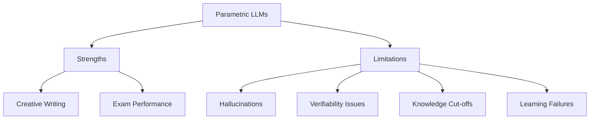
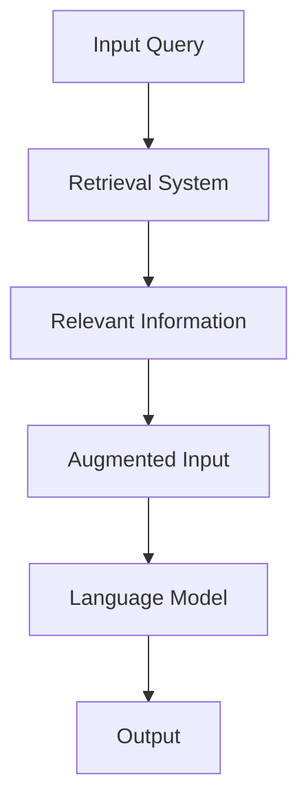
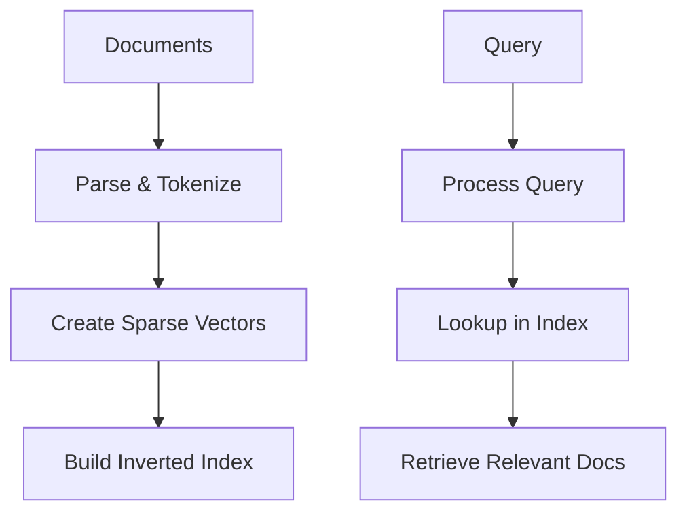
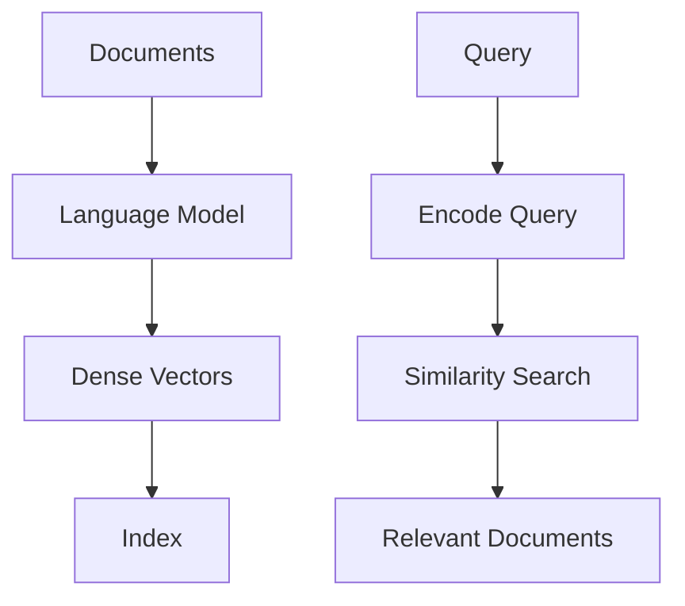
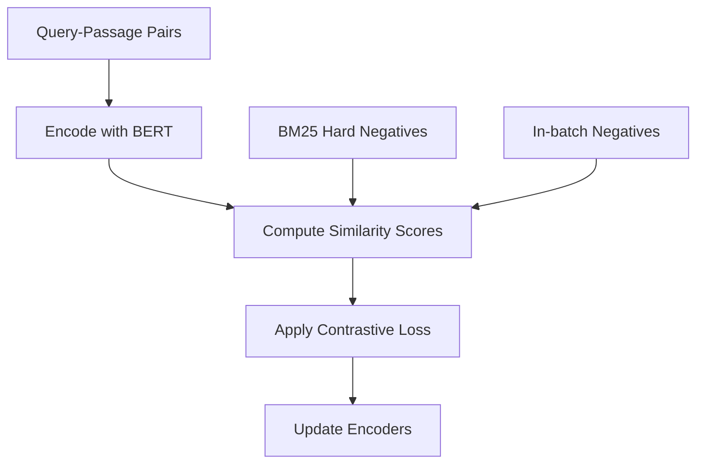
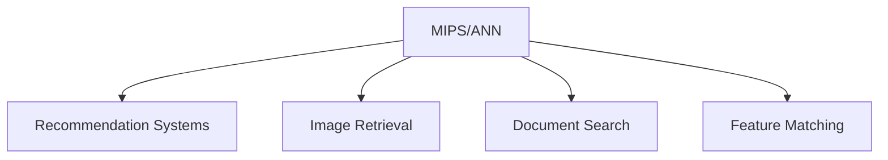
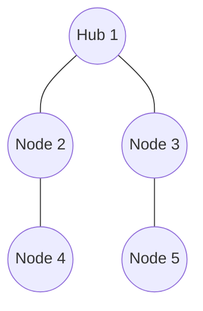

# LLMs | Retrieval-based Language Models-I | Lec16.1

# Retrieval-based Language Models: A Comprehensive Overview 📚🔍

## 1. Motivation 🎯

The rise of retrieval-based language models (LMs) is driven by the need to address limitations in traditional parametric LLMs and enhance their capabilities.

### 1.1 Drawbacks of Parametric LLMs 🚫

| Issue | Description |
|-------|-------------|
| Hallucination | Generation of false or nonsensical information |
| Verification challenges | Difficulty in fact-checking model outputs |
| Limited knowledge scope | Constrained by training data cutoff |

### 1.2 The Open Book Paradigm 📖

Retrieval-based LMs aim to transition from a "closed book" to an "open book" approach:

- **Closed Book**: Relies solely on internal parameters
- **Open Book**: Accesses external knowledge during inference

## 2. Major Components of Retrieval-based LMs 🧩


1. **Index**: Organize and store external knowledge
2. **Retrieve**: Select relevant information
3. **Read**: Process and understand retrieved data
4. **Generate**: Produce output based on context and retrieved info

## 3. Retrieval Methods 🔍

### 3.1 Sparse Retrieval
- Based on traditional IR techniques
- Example: TF-IDF, BM25

### 3.2 Dense Retrieval
- Utilizes neural network embeddings
- Example: BERT-based encoders

### 3.3 Reranking
- Refines initial retrieval results
- Example: Cross-encoder models

### 3.4 Black-box Retrieval
- Treats retriever as an opaque system
- Example: API-based retrieval services

## 4. Seminal Works in Retrieval-based LMs 🌟

| Model | Key Features |
|-------|--------------|
| kNN-LM | Combines neural LMs with nearest neighbor retrieval |
| RETRO | Chunked cross-attention for efficient retrieval |
| REALM | End-to-end training of retriever and reader |
| RAG | Fusion of retrieval and generation for open-domain QA |

## 5. Overview of Training Techniques 🏋️‍♀️

```python
def train_retrieval_lm(model, data):
    # Training approaches
    if independent:
        train_retriever(model.retriever, data)
        train_reader(model.reader, data)
    elif sequential:
        pretrain_retriever(model.retriever, data)
        finetune_reader(model.reader, data, model.retriever)
    elif joint:
        train_end_to_end(model, data)
    
    return model
```

1. **Independent Training**: Separate optimization of retriever and reader
2. **Sequential Training**: Pre-train retriever, then fine-tune reader
3. **Joint Training**: End-to-end optimization of entire system

## 6. Limitations and Challenges ⚠️

Despite their advantages, retrieval-based LMs face several challenges:

- **Lost in the Middle**: Difficulty handling long retrieved contexts
- **Persistent Hallucinations**: May still generate false information
- **Retriever Failures**: Incorrect or irrelevant retrievals impact performance

## 7. Future Directions 🚀

1. **Improved Retrieval Mechanisms**: Develop more accurate and efficient retrieval methods
2. **Enhanced Integration**: Better fusion of retrieved information and model knowledge
3. **Scalability**: Address challenges in handling larger knowledge bases
4. **Robustness**: Improve resilience against retriever failures and hallucinations

---

> 💡 **Pro Tip**: Retrieval-based LMs represent a promising direction in AI research, combining the strengths of traditional information retrieval with the power of neural language models.

Would you like me to elaborate on any specific aspect of retrieval-based language models?

# Parametric LLMs: Creative Brilliance vs. Critical Limitations 🧠💡

## 1. The Duality of Parametric LLMs 🎭

Parametric Language Models (LLMs) exhibit a fascinating duality, excelling in certain areas while facing significant challenges in others. Let's explore this dichotomy:

### 1.1 Strengths: Creative Prowess and Exam Performance 🌟

| Aspect | Description | Example |
|--------|-------------|---------|
| Creative Writing | Exceptional ability to generate diverse, engaging content | Poetry, stories, scripts |
| Exam Performance | Strong results in standardized tests and academic assessments | SAT, GRE, professional certifications |



### 1.2 Core Limitations: The Achilles' Heel 🚫

Despite their strengths, parametric LLMs face several critical challenges:

1. **Hallucinations** 🌀
   - Definition: Generation of false or nonsensical information
   - Impact: Reduces reliability and trustworthiness of outputs

2. **Verifiability Issues** 🔍
   - Challenge: Difficulty in fact-checking model-generated content
   - Consequence: Potential spread of misinformation

3. **Knowledge Cut-offs** ✂️
   - Problem: Limited to information available up to training data cutoff
   - Effect: Inability to access or utilize recent information

4. **Learning Failures** 📉
   - Issue: Struggles with continuous learning and adaptation
   - Result: Static knowledge base that becomes outdated over time

## 2. Deep Dive: Hallucinations in Parametric LLMs 🕳️

Hallucinations represent one of the most significant challenges in parametric LLMs. Let's explore this phenomenon in detail:

### 2.1 Types of Hallucinations

1. **Factual Hallucinations**
   - Description: Generation of false facts or events
   - Example: `"The Eiffel Tower was built in 1920 by Leonardo da Vinci."`

2. **Semantic Hallucinations**
   - Description: Producing logically inconsistent or nonsensical statements
   - Example: `"Cats are known for their ability to photosynthesize sunlight for energy."`

3. **Contextual Hallucinations**
   - Description: Generating information that's inconsistent with the given context
   - Example: In a conversation about cars, suddenly discussing unrelated submarine technology

### 2.2 Causes of Hallucinations

```python
def hallucination_factors(model):
    causes = [
        "Overfitting to training data",
        "Lack of real-world grounding",
        "Insufficient factual knowledge",
        "Biases in training data",
        "Limitations in model architecture"
    ]
    return causes
```

### 2.3 Impact of Hallucinations

- Reduced trust in AI systems
- Potential spread of misinformation
- Challenges in critical applications (e.g., healthcare, finance)

## 3. Addressing the Limitations: Future Directions 🚀

To overcome these challenges, researchers are exploring various approaches:

1. **Improved Training Techniques**
   - Curriculum learning
   - Adversarial training
   - Continual learning strategies

2. **External Knowledge Integration**
   - Retrieval-augmented generation (RAG)
   - Knowledge graph integration

3. **Explainable AI**
   - Techniques to provide reasoning behind model outputs
   - Confidence scoring for generated content

4. **Hybrid Systems**
   - Combining parametric LLMs with symbolic AI approaches
   - Integrating human feedback loops

---

> 💡 **Key Takeaway**: While parametric LLMs demonstrate remarkable capabilities in creative tasks and structured assessments, addressing their core limitations—especially hallucinations and verifiability issues—remains crucial for their reliable and responsible deployment in real-world applications.

# Closed Book vs Open Book Exams: Parametric LLMs vs Retrieval-based LLMs 📚🧠

## Overview

This image illustrates the fundamental difference between parametric Language Models (LLMs) and retrieval-based LLMs in the context of answering queries, analogous to closed book and open book exams respectively.

## Parametric LLMs: The "Closed Book" Approach 📕

### Key Characteristics:
- **Knowledge Integration**: "Bake in Knowledge at Train Time"
- **Query Processing**: Direct from query to answer
- **Analogy**: Closed book exam

### Process Flow:
1. 🔄 Query input
2. 🧠 Processing through the neural network (represented by the brain icon)
3. 💡 Generation of answer
4. ✅ Output of answer

### Advantages:
- Fast inference time
- No need for external knowledge access during runtime

### Limitations:
- Limited to knowledge acquired during training
- Potential for outdated information
- Higher risk of hallucinations

## Retrieval-based LLMs: The "Open Book" Approach 📖

### Key Characteristics:
- **Knowledge Access**: "Model can use External Docs at Test"
- **Query Processing**: Involves external document retrieval
- **Analogy**: Open book exam

### Process Flow:
1. 🔄 Query input
2. 📚 Retrieval of relevant external documents
3. 🤖 Processing of query and retrieved information
4. 💡 Generation of answer based on combined knowledge
5. ✅ Output of answer

### Advantages:
- Access to up-to-date information
- Potential for more accurate and verifiable answers
- Flexibility to incorporate new knowledge without retraining

### Challenges:
- Increased complexity in system design
- Potential latency due to retrieval step
- Dependency on the quality and relevance of retrieved documents

## Comparative Analysis

| Aspect | Parametric LLMs | Retrieval-based LLMs |
|--------|-----------------|----------------------|
| Knowledge Source | Internal parameters | External documents + parameters |
| Scalability | Limited by model size | Scales with external knowledge base |
| Inference Speed | Generally faster | May be slower due to retrieval step |
| Adaptability | Requires retraining for new info | Can adapt to new info in real-time |
| Verifiability | Challenging | Potentially easier (source documents) |

## Implications for AI Development 🚀

1. **Hybrid Approaches**: Combining strengths of both paradigms
2. **Continual Learning**: Enhancing LLMs' ability to update knowledge
3. **Ethical Considerations**: Balancing performance with transparency and reliability

---

> 💡 **Key Takeaway**: The shift from parametric to retrieval-based LLMs represents a significant evolution in AI's approach to knowledge management and query answering, mirroring the transition from closed book to open book examination strategies in human learning contexts.

# How to Use the Book: Integrating External Knowledge in LMs 📚🧠

## Overview

This guide explores three distinct approaches to incorporating external knowledge ("the Book") into Language Models (LMs). Each method represents a different stage of integration in the LM's processing pipeline, offering unique advantages and challenges.

## 1. Output Interpolations: Post-Processing Refinement 🔄

**When**: After solving the question yourself

### Process Flow


### Key Characteristics
- **Timing**: Applied after initial LM generation
- **Integration Level**: Low (external to LM core)
- **Flexibility**: High adaptability to different knowledge sources

### Pros and Cons
| Advantages | Challenges |
|------------|------------|
| Minimal changes to LM architecture | Potential inconsistencies with LM output |
| Easy to implement and update | Limited influence on reasoning process |
| Adaptable to various knowledge sources | May introduce latency in output generation |

## 2. Intermediate Fusion: Architectural Integration 🔀

**Approach**: Modify the LM architecture to be aware of the book

### Implementation Strategies
1. **Attention Mechanisms**: Incorporate book knowledge into self-attention layers
2. **Knowledge-Aware Embeddings**: Enhance input embeddings with external information
3. **Adaptive Computation**: Dynamically adjust LM processing based on book content

### Technical Considerations
```python
class KnowledgeAwareLM(nn.Module):
    def __init__(self, base_lm, knowledge_encoder):
        super().__init__()
        self.base_lm = base_lm
        self.knowledge_encoder = knowledge_encoder
        
    def forward(self, input_ids, knowledge_context):
        encoded_knowledge = self.knowledge_encoder(knowledge_context)
        lm_output = self.base_lm(input_ids, context=encoded_knowledge)
        return lm_output
```

### Pros and Cons
| Advantages | Challenges |
|------------|------------|
| Deep integration of external knowledge | Requires significant architectural changes |
| Potential for more informed reasoning | Increased model complexity and training time |
| Unified processing of input and knowledge | May require retraining or fine-tuning |

## 3. Input Augmentation (RAG): Pre-Processing Enhancement 🚀

**Timing**: Before you start solving

### Featured Techniques
- **RAG (Retrieval-Augmented Generation)**
- **REALM (Retrieval-Enhanced Auto-regressive Language Model)**

### Process Diagram


### Implementation Example
```python
def rag_process(query, knowledge_base):
    retrieved_info = retrieve_relevant_info(query, knowledge_base)
    augmented_input = f"{query}\nContext: {retrieved_info}"
    output = language_model(augmented_input)
    return output
```

### Pros and Cons
| Advantages | Challenges |
|------------|------------|
| Preserves original LM architecture | Retrieval quality impacts performance |
| Allows real-time knowledge updates | May introduce latency due to retrieval |
| Enhances model knowledge without retraining | Requires efficient retrieval mechanisms |

## Comparative Analysis 📊

| Approach | Integration Point | Architectural Impact | Flexibility | Performance Impact |
|----------|-------------------|----------------------|-------------|---------------------|
| Output Interpolations | Post-processing | Minimal | High | Low-Medium |
| Intermediate Fusion | Internal layers | Significant | Medium | High |
| Input Augmentation (RAG) | Pre-processing | Low | Very High | Medium-High |

## Key Takeaways 💡

1. **Diverse Integration Strategies**: Each method offers unique trade-offs between integration depth, implementation complexity, and performance impact.
2. **Architectural Considerations**: The choice of method significantly influences the LM's structure, processing flow, and potential for knowledge utilization.
3. **Flexibility vs. Deep Integration**: Input augmentation (RAG) offers high flexibility and ease of implementation, while intermediate fusion potentially provides deeper, more seamless integration of external knowledge.

---

> 🔬 **Research Direction**: Exploring hybrid approaches that combine elements of multiple integration methods could lead to more robust and versatile LM systems capable of leveraging external knowledge effectively across various tasks and domains.

# Sparse Retrieval: Efficient Document Matching in NLP 🔍📊

## Overview

Sparse Retrieval is a fundamental technique in information retrieval and Natural Language Processing (NLP) for efficiently matching queries to relevant documents. This method represents text as sparse vectors, enabling fast and scalable search across large document collections.

## Key Concepts 🗝️

1. **Sparse Word Frequency Vectors**: Represent text as vectors where most elements are zero
2. **Length Normalization**: Adjust vector values to account for document length
3. **Inner Product / Cosine Similarity**: Measure relevance between query and documents

## Vector Representation Process 🔢

### Query Vectorization
```python
q = "what is nlp"
q_vector = {
    "what": 0.33,
    "is": 0.33,
    "nlp": 0.33,
    "candy": 0,
    "language": 0,
    # ... (other words in vocabulary)
}
```

### Document Vectorization
```python
documents = {
    "d1": "what is life ? candy is life !",
    "d2": "nlp is an acronym for natural language processing",
    "d3": "I like to do good research on nlp"
}

d1_vector = {"what": 0.25, "is": 0.25, "life": 0.25, "candy": 0.125, ...}
d2_vector = {"nlp": 0.125, "is": 0.125, "an": 0.125, "acronym": 0.125, ...}
d3_vector = {"I": 0.125, "like": 0.125, "to": 0.125, "do": 0.125, "good": 0.125, "research": 0.125, "on": 0.125, "nlp": 0.125}
```

## Similarity Calculation 📊

| Query-Document Pair | Inner Product | Calculation |
|---------------------|---------------|-------------|
| q * d1 | 0.165 | (0.33 * 0.25) + (0.33 * 0.25) |
| q * d2 | 0.0825 | (0.33 * 0.125) + (0.33 * 0.125) |
| q * d3 | 0.0413 | (0.33 * 0.125) |

### Visual Representation


## Advantages of Sparse Retrieval 🌟

1. **Efficiency**: Fast computation due to sparse nature of vectors
2. **Scalability**: Easily handles large vocabularies and document collections
3. **Interpretability**: Clear relationship between words and their importance

## Limitations and Considerations ⚠️

- Ignores word order and context
- May miss semantic similarities not captured by exact word matches
- Requires careful preprocessing (e.g., handling stop words, stemming)

## Implementation Tips 💡

```python
from collections import Counter
from math import sqrt

def vectorize(text):
    word_counts = Counter(text.split())
    length = sqrt(sum(count**2 for count in word_counts.values()))
    return {word: count/length for word, count in word_counts.items()}

def inner_product(vec1, vec2):
    return sum(vec1.get(word, 0) * vec2.get(word, 0) for word in set(vec1) | set(vec2))

# Example usage
query_vec = vectorize("what is nlp")
doc_vecs = {doc_id: vectorize(text) for doc_id, text in documents.items()}
similarities = {doc_id: inner_product(query_vec, doc_vec) for doc_id, doc_vec in doc_vecs.items()}
best_match = max(similarities, key=similarities.get)
```

## Conclusion 🏁

Sparse Retrieval offers a powerful, efficient method for document matching in NLP applications. By representing text as normalized word frequency vectors and using simple similarity metrics, it enables rapid search and ranking across large document collections. While it has limitations in capturing semantic nuances, its speed and scalability make it a valuable tool in many information retrieval scenarios.

---

> 🔬 **Further Research**: Explore hybrid approaches combining sparse retrieval with dense semantic representations to leverage the strengths of both methods.

# Term Weighting in Information Retrieval: A Comprehensive Guide 📊🔍

## Overview

Term weighting is a crucial technique in information retrieval that assigns importance to words in a document or query. This guide explores the concept, focusing on the TF-IDF method and its advanced variant, BM25.

## Key Concepts 🗝️

1. **Importance Hierarchy**: Not all words are created equal in information retrieval.
2. **Frequency vs. Significance**: Low-frequency words often carry more semantic weight.
3. **Context Matters**: The importance of a term depends on both document and corpus-level statistics.

## Term Importance Breakdown 📈

### High-Importance Terms (Low Frequency) 🟢
- Examples: NLP, Candy
- Characteristics: Domain-specific, content-rich

### Low-Importance Terms (High Frequency) 🔴
- Examples: the, a, for, then, them
- Characteristics: Stop words, grammatical constructs

## TF-IDF: The Cornerstone of Term Weighting 🏗️

TF-IDF (Term Frequency-Inverse Document Frequency) balances the importance of a term within a document against its prevalence across the entire corpus.

### Components

1. **TF (Term Frequency)**
   ```math
   TF(t,d) = \frac{freq(t,d)}{\sum_{t'} freq(t',d)}
   ```
   - Measures how often a term appears in a document
   - Normalized by document length

2. **IDF (Inverse Document Frequency)**
   ```math
   IDF(t) = \log \left( \frac{|D|}{\sum_{d' \in D} \delta(freq(t,d') > 0)} \right)
   ```
   - Penalizes terms that appear in many documents
   - Boosts rare, potentially more informative terms

3. **TF-IDF Score**
   ```math
   TF-IDF(t,d) = TF(t,d) \times IDF(t)
   ```
   - Combines local (TF) and global (IDF) term importance

## BM25: The Evolution of TF-IDF 🚀

BM25 (Best Matching 25) is an advanced ranking function that builds upon the TF-IDF concept.

### Formula
```math
BM-25(t,d) = IDF(t) \cdot \frac{freq(t,d) \cdot (k_1 + 1)}{freq(t,d) + k_1 \cdot (1 - b + b \cdot \frac{|d|}{avgdl})}
```

### Key Features
- **Saturation**: Limits the impact of high-frequency terms
- **Length Normalization**: Adjusts for document length biases
- **Tunable Parameters**: `k1` and `b` allow fine-tuning for specific corpora

## Practical Implementation 💻

```python
import math
from collections import Counter

def compute_tf_idf(documents):
    # Compute document frequencies
    df = Counter()
    for doc in documents:
        df.update(set(doc.split()))
    
    # Compute IDF
    N = len(documents)
    idf = {word: math.log(N / count) for word, count in df.items()}
    
    # Compute TF-IDF
    tf_idf = []
    for doc in documents:
        words = doc.split()
        tf = Counter(words)
        doc_tf_idf = {word: (count / len(words)) * idf[word] 
                      for word, count in tf.items()}
        tf_idf.append(doc_tf_idf)
    
    return tf_idf

# Usage
docs = ["NLP is fascinating", "Candy is sweet", "The the the"]
results = compute_tf_idf(docs)
```

## Advantages and Considerations 🤔

### Pros
- 📊 Balances term specificity and document relevance
- 🔧 Adaptable to various document collections
- 🚀 Efficient computation for large-scale retrieval systems

### Cons
- 📉 Ignores term positions and relationships
- 🧠 Lacks semantic understanding
- 🔤 May struggle with synonyms and polysemy

## Advanced Topics and Future Directions 🔮

1. **Word Embeddings**: Incorporating semantic similarity
2. **Contextual Term Weighting**: Using language models for dynamic weighting
3. **Multi-lingual IR**: Adapting term weighting for cross-language retrieval

---

> 💡 **Pro Tip**: While TF-IDF and BM25 are powerful, consider combining them with modern neural approaches for state-of-the-art performance in complex information retrieval tasks.

# Inverted Index: Powering Efficient Information Retrieval 🚀📚

## Overview

An inverted index is a crucial data structure in information retrieval systems, enabling rapid and efficient lookup of documents containing specific terms. This powerful indexing technique forms the backbone of modern search engines and text analysis tools.

## Key Concepts 🗝️

1. **Sparse Vector Representation**: Documents as term frequency vectors
2. **Index Structure**: Term-to-document mapping
3. **Efficient Lookup**: Quick retrieval of relevant documents

## Detailed Breakdown 📊

### Sparse Vectors 🧮

The image showcases three documents (d₁, d₂, d₃) represented as sparse vectors:

| Term     | d₁ | d₂ | d₃ |
|----------|---:|---:|---:|
| what     | 2  | 0  | 0  |
| candy    | 1  | 0  | 0  |
| nlp      | 0  | 1  | 1  |
| is       | 2  | 1  | 0  |
| language | 0  | 1  | 0  |
| ...      | ... | ... | ... |

### Inverted Index Structure 🏗️

```json
{
  "what": [1],
  "candy": [1],
  "nlp": [2, 3],
  "is": [1, 2],
  "language": [2],
  ...
}
```

This structure maps each term to a list of document IDs containing that term.

## How It Works 🛠️

1. **Document Parsing**: Break documents into terms
2. **Vector Creation**: Generate sparse vectors for each document
3. **Index Building**: Construct the inverted index
4. **Query Processing**: Use the index for rapid document retrieval



## Advantages 📈

- 🚀 **Speed**: Dramatically faster than linear search
- 💾 **Space Efficiency**: Compact representation of document-term relationships
- 🔍 **Flexibility**: Supports various query types (boolean, phrase, proximity)

## Implementation Example 💻

```python
from collections import defaultdict

def build_inverted_index(documents):
    index = defaultdict(list)
    for doc_id, doc in enumerate(documents, start=1):
        for term in doc.split():
            index[term].append(doc_id)
    return dict(index)

# Example usage
docs = [
    "what is candy",
    "nlp is language processing",
    "nlp is fascinating"
]
inverted_index = build_inverted_index(docs)
print(inverted_index)
```

## Real-World Application: Apache Lucene 🌟

Apache Lucene is a high-performance, full-featured text search engine library written in Java. It utilizes inverted indexes to provide:

- 🔎 Fast full-text search capabilities
- 📊 Scalable indexing for large document collections
- 🧰 Customizable ranking and scoring algorithms

### Lucene Features

1. **Cross-Platform**: Java-based, runs on various operating systems
2. **Extensible**: Supports custom analyzers and query types
3. **High-Performance**: Optimized for speed and memory efficiency

```java
// Simplified Lucene indexing example
IndexWriter writer = new IndexWriter(directory, config);
Document doc = new Document();
doc.add(new TextField("content", "Inverted index in action", Field.Store.YES));
writer.addDocument(doc);
writer.close();
```

## Advanced Concepts and Future Directions 🔮

1. **Compression Techniques**: Optimize index size and lookup speed
2. **Distributed Indexing**: Scale to massive document collections
3. **Machine Learning Integration**: Enhance relevance ranking

---

> 💡 **Pro Tip**: While inverted indexes excel in text search, consider combining them with modern embedding techniques for improved semantic understanding in advanced retrieval systems.

# Dense Embeddings in Information Retrieval 🔍

## Core Concept Overview
Dense embeddings represent a powerful approach to modern information retrieval, transforming text into rich numerical representations that capture semantic meaning.

## Implementation Flow 🔄

### 1. Document Processing Phase 📚
**Initial Setup (One-time Process)**
```python
from transformers import AutoTokenizer, AutoModel

# Initialize model and tokenizer
model_name = "bert-base-uncased"
tokenizer = AutoTokenizer.from_pretrained(model_name)
model = AutoModel.from_pretrained(model_name)
```

### 2. Embedding Options 🛠️

#### Pre-trained Embeddings
| Model | Advantages | Use Case |
|-------|------------|----------|
| BERT | Production-ready, well-documented | General purpose |
| RoBERTa | Robust performance | Enhanced accuracy |
| DistilBERT | Lightweight, faster inference | Resource-constrained environments |

#### Custom-trained Embeddings
```python
def train_custom_embeddings(documents, labels):
    # Custom training logic
    return trained_model
```

### 3. Query Process ⚡

#### Real-time Flow


## Implementation Example 💻

```python
def encode_documents(documents, model, tokenizer):
    embeddings = []
    for doc in documents:
        inputs = tokenizer(doc, return_tensors="pt", padding=True, truncation=True)
        outputs = model(**inputs)
        embeddings.append(outputs.last_hidden_state.mean(dim=1))
    return embeddings

def find_similar_documents(query_embedding, document_embeddings, top_k=5):
    similarities = compute_similarity(query_embedding, document_embeddings)
    return get_top_k_results(similarities, top_k)
```

## Best Practices 🎯
1. **Preprocessing**
   - Clean and normalize text
   - Handle special characters consistently
   - Apply appropriate tokenization

2. **Performance Optimization**
   - Batch processing for large document sets
   - GPU acceleration when available
   - Efficient indexing structures (e.g., FAISS, Annoy)

## Advanced Considerations ⚙️
- Index maintenance and updates
- Handling out-of-vocabulary tokens
- Scaling strategies for large document collections


# Dense Embeddings: Revolutionizing Document Retrieval 🚀📊

## Overview

Dense embeddings represent a paradigm shift in document retrieval, leveraging the power of Language Models (LMs) to create rich, semantic representations of text. This approach significantly enhances the ability to find relevant documents beyond simple keyword matching.

## Key Concepts 🗝️

1. **Document Encoding**: Transform text into high-dimensional vectors
2. **Semantic Similarity**: Capture meaning, not just lexical matches
3. **Efficient Indexing**: One-time task for rapid retrieval

## Dense Embedding Process 🔄



## Embedding Options 🛠️

### 1. Out-of-the-Box Embeddings 📦

- **Example**: BERT (Bidirectional Encoder Representations from Transformers)
- **Characteristics**:
  - Pre-trained on large corpora
  - General-purpose semantic understanding
  - Ready to use without additional training

#### BERT Embedding Example
```python
from transformers import BertTokenizer, BertModel
import torch

tokenizer = BertTokenizer.from_pretrained('bert-base-uncased')
model = BertModel.from_pretrained('bert-base-uncased')

def get_bert_embedding(text):
    inputs = tokenizer(text, return_tensors="pt", padding=True, truncation=True)
    with torch.no_grad():
        outputs = model(**inputs)
    return outputs.last_hidden_state.mean(dim=1).squeeze().numpy()

# Example usage
doc_embedding = get_bert_embedding("Dense embeddings revolutionize retrieval")
```

### 2. Learned Embeddings 🧠

- **Characteristics**:
  - Tailored to specific domains or tasks
  - Optimized for retrieval performance
  - Requires training data and computational resources

#### Training Process
1. Prepare paired data (query-document pairs)
2. Define a neural network architecture
3. Train the model to minimize distance between related pairs
4. Fine-tune on domain-specific data if available

## Indexing and Retrieval 🔍

### Indexing (One-Time Task)
1. Encode all documents using the chosen embedding method
2. Store vectors in an efficient data structure (e.g., FAISS, Annoy)

```python
import faiss

# Assuming 'embeddings' is a numpy array of document embeddings
dimension = embeddings.shape[1]
index = faiss.IndexFlatL2(dimension)
index.add(embeddings)

# Save index for future use
faiss.write_index(index, "document_index.faiss")
```

### Retrieval
1. Encode the query using the same embedding method
2. Perform similarity search in the index
3. Retrieve top-k most similar documents

```python
# Load pre-built index
index = faiss.read_index("document_index.faiss")

# Encode query
query_embedding = get_bert_embedding("How do dense embeddings work?")

# Perform search
k = 5  # Number of results to retrieve
distances, indices = index.search(query_embedding.reshape(1, -1), k)

# 'indices' now contains the IDs of the most similar documents
```

## Advantages and Considerations 📊

### Pros ✅
- Captures semantic relationships
- Effective for long-tail queries
- Supports cross-lingual retrieval

### Cons ⚠️
- Computationally intensive
- Requires significant storage
- May struggle with highly specific or rare terms

## Advanced Techniques and Future Directions 🔮

1. **Hybrid Models**: Combine dense and sparse retrieval for optimal performance
2. **Contrastive Learning**: Improve embedding quality through advanced training techniques
3. **Multi-modal Embeddings**: Incorporate image and text for richer representations

---

> 💡 **Pro Tip**: While dense embeddings offer powerful semantic understanding, consider combining them with traditional methods like BM25 for a robust retrieval system that balances semantic and lexical matching.

# Dense Embeddings: Revolutionizing Document Retrieval 🚀📊

## Overview

Dense embeddings represent a paradigm shift in document retrieval, leveraging the power of Language Models (LMs) to create rich, semantic representations of text. This approach significantly enhances the ability to find relevant documents beyond simple keyword matching.

## Key Concepts 🗝️

1. **Document Encoding**: Transform text into high-dimensional vectors
2. **Semantic Similarity**: Capture meaning, not just lexical matches
3. **Efficient Indexing**: One-time task for rapid retrieval

## Dense Embedding Process 🔄


## Embedding Options 🛠️

### 1. Out-of-the-Box Embeddings 📦

- **Example**: BERT (Bidirectional Encoder Representations from Transformers)
- **Characteristics**:
  - Pre-trained on large corpora
  - General-purpose semantic understanding
  - Ready to use without additional training

#### BERT Embedding Example
```python
from transformers import BertTokenizer, BertModel
import torch

tokenizer = BertTokenizer.from_pretrained('bert-base-uncased')
model = BertModel.from_pretrained('bert-base-uncased')

def get_bert_embedding(text):
    inputs = tokenizer(text, return_tensors="pt", padding=True, truncation=True)
    with torch.no_grad():
        outputs = model(**inputs)
    return outputs.last_hidden_state.mean(dim=1).squeeze().numpy()

# Example usage
doc_embedding = get_bert_embedding("Dense embeddings revolutionize retrieval")
```

### 2. Learned Embeddings 🧠

- **Characteristics**:
  - Tailored to specific domains or tasks
  - Optimized for retrieval performance
  - Requires training data and computational resources

#### Training Process
1. Prepare paired data (query-document pairs)
2. Define a neural network architecture
3. Train the model to minimize distance between related pairs
4. Fine-tune on domain-specific data if available

## Indexing and Retrieval 🔍

### Indexing (One-Time Task)
1. Encode all documents using the chosen embedding method
2. Store vectors in an efficient data structure (e.g., FAISS, Annoy)

```python
import faiss

# Assuming 'embeddings' is a numpy array of document embeddings
dimension = embeddings.shape[1]
index = faiss.IndexFlatL2(dimension)
index.add(embeddings)

# Save index for future use
faiss.write_index(index, "document_index.faiss")
```

### Retrieval
1. Encode the query using the same embedding method
2. Perform similarity search in the index
3. Retrieve top-k most similar documents

```python
# Load pre-built index
index = faiss.read_index("document_index.faiss")

# Encode query
query_embedding = get_bert_embedding("How do dense embeddings work?")

# Perform search
k = 5  # Number of results to retrieve
distances, indices = index.search(query_embedding.reshape(1, -1), k)

# 'indices' now contains the IDs of the most similar documents
```

## Advantages and Considerations 📊

### Pros ✅
- Captures semantic relationships
- Effective for long-tail queries
- Supports cross-lingual retrieval

### Cons ⚠️
- Computationally intensive
- Requires significant storage
- May struggle with highly specific or rare terms

## Advanced Techniques and Future Directions 🔮

1. **Hybrid Models**: Combine dense and sparse retrieval for optimal performance
2. **Contrastive Learning**: Improve embedding quality through advanced training techniques
3. **Multi-modal Embeddings**: Incorporate image and text for richer representations

---

> 💡 **Pro Tip**: While dense embeddings offer powerful semantic understanding, consider combining them with traditional methods like BM25 for a robust retrieval system that balances semantic and lexical matching.

# Training Dense Embeddings: Advanced Techniques for Semantic Retrieval 🧠🔍

## Overview

Training dense embeddings is a crucial step in developing powerful retrieval systems that capture semantic relationships between queries and documents. This guide explores state-of-the-art techniques, focusing on contrastive learning approaches.

## Key Concepts 🗝️

1. **Positive and Negative Samples**: Defining relevant and irrelevant document pairs
2. **Contrastive Loss**: Training objective to differentiate between similar and dissimilar items
3. **Hard Negatives**: Challenging examples that improve model robustness
4. **In-batch Negatives**: Efficient use of batch data for negative sampling

## Dense Passage Retriever (DPR) 📚

DPR, introduced by Karpukhin et al. (2020), represents a significant advancement in dense embedding training.

### Core Features
- 🎯 Dual encoder architecture
- 🔍 BM25-based hard negative mining
- 🧮 In-batch negative sampling

### Training Process


### Implementation Highlights
```python
import torch
import torch.nn.functional as F

def dpr_loss(query_emb, pos_doc_emb, neg_doc_embs, temperature=0.1):
    pos_score = torch.sum(query_emb * pos_doc_emb, dim=-1) / temperature
    neg_scores = torch.matmul(query_emb, neg_doc_embs.transpose(0, 1)) / temperature
    
    loss = -pos_score + torch.logsumexp(torch.cat([pos_score.unsqueeze(-1), neg_scores], dim=-1), dim=-1)
    return loss.mean()

# Usage in training loop
optimizer.zero_grad()
loss = dpr_loss(query_embeddings, positive_doc_embeddings, negative_doc_embeddings)
loss.backward()
optimizer.step()
```

## Contriever: Unsupervised Dense Retrieval 🌟

Contriever, proposed by Izacard et al. (2022), introduces an innovative unsupervised approach to training dense embeddings.

### Key Innovations
- 🔄 Self-supervised learning
- 📊 Random span selection for positive pairs
- 🌐 Language-agnostic design

### Training Methodology
1. **Span Selection**: Randomly choose two spans from the same document
2. **Contrastive Learning**: Train model to recognize these spans as semantically related
3. **Negative Sampling**: Use other spans in the batch as negatives

```python
def select_random_span(text, max_length=64):
    words = text.split()
    start = random.randint(0, max(0, len(words) - max_length))
    end = min(start + max_length, len(words))
    return ' '.join(words[start:end])

def contriever_loss(span1_emb, span2_emb, negative_embs, temperature=0.07):
    sim_pos = torch.sum(span1_emb * span2_emb, dim=-1) / temperature
    sim_neg = torch.matmul(span1_emb, negative_embs.T) / temperature
    
    loss = -sim_pos + torch.logsumexp(torch.cat([sim_pos.unsqueeze(-1), sim_neg], dim=-1), dim=-1)
    return loss.mean()

# Training loop
for batch in data_loader:
    span1 = select_random_span(batch['text'])
    span2 = select_random_span(batch['text'])
    
    span1_emb, span2_emb = model(span1), model(span2)
    negative_embs = model(batch['negative_examples'])
    
    loss = contriever_loss(span1_emb, span2_emb, negative_embs)
    loss.backward()
    optimizer.step()
```

## Comparative Analysis 📊

| Feature | DPR | Contriever |
|---------|-----|------------|
| Training Data | Supervised (Q&A pairs) | Unsupervised (raw text) |
| Negative Sampling | BM25 + In-batch | In-batch only |
| Language Support | Language-specific | Multilingual |
| Computational Cost | Higher (due to BM25) | Lower |
| Scalability | Good | Excellent |

## Advanced Techniques and Future Directions 🚀

1. **Hybrid Negative Sampling**: Combining multiple strategies for diverse negatives
2. **Curriculum Learning**: Gradually increasing difficulty of training samples
3. **Multi-task Learning**: Incorporating auxiliary tasks for richer embeddings
4. **Knowledge Distillation**: Compressing large models for efficient deployment

---

> 💡 **Pro Tip**: When implementing these advanced embedding techniques, consider the trade-offs between model complexity, training time, and retrieval performance. Experiment with different hyperparameters and negative sampling strategies to find the optimal configuration for your specific use case.

This image appears to be demonstrating a concept called "Independent Cropping" from a paper by Izacard et al. (2022) related to Contriever, which seems to be an AI or machine learning system.

The image shows how text can be split or "cropped" independently while maintaining semantic relationships. Specifically, it shows:

1. A source text box about Apple's 1997 merger with NeXT and the return of a CEO
2. Two independently cropped segments connected by arrows:
   - "Apple merged with NeXT"
   - "Steve Jobs became CEO of"

These segments are connected with lines, and there's a label "Positives" between two of the cropped segments, suggesting this might be demonstrating how related text segments can be identified or matched while maintaining their semantic meaning, even when independently cropped.

This appears to be a technical illustration showing how the system can break down and relate different parts of text while preserving meaningful connections between them.

# Understanding MIPS & ANN Search Techniques 🔍

## Core Concepts Overview

### Maximum Inner Product Search (MIPS) 📊
MIPS is a fundamental technique for efficient similarity search in high-dimensional spaces, particularly useful for:
- **Recommendation Systems**
- **Neural Network Inference**
- **Information Retrieval**

```math
MIPS(q, X) = argmax_{x ∈ X} q^T x
```

## Approximate Nearest Neighbor (ANN) Search 🎯

### Key Benefits
- **Sub-linear Time Complexity**: Dramatically faster than exhaustive search
- **Space Efficiency**: Optimized memory usage
- **Scalability**: Handles large-scale datasets effectively

### Implementation Methods 🛠️

#### 1. Locality Sensitive Hashing (LSH)
```python
def lsh_partition(vector_space):
    # Create hash functions
    hash_functions = generate_hash_family()
    # Partition space
    buckets = defaultdict(list)
    for vector in vector_space:
        bucket_id = compute_hash(vector, hash_functions)
        buckets[bucket_id].append(vector)
    return buckets
```

#### 2. Space Partitioning Structure
| Component | Purpose |
|-----------|----------|
| Buckets | Store similar vectors together |
| Hash Functions | Map vectors to buckets |
| Lookup Table | Enable quick retrieval |

### Performance Characteristics 📈

1. **Time Complexity**
   - Build: O(n log n)
   - Query: O(log n) average case

2. **Space Complexity**
   - Index: O(n)
   - Additional Metadata: O(n)

## Best Practices 💡

- **Partition Size**: Balance between search speed and accuracy
- **Hash Function Selection**: Choose based on data distribution
- **Index Updates**: Consider dynamic vs static datasets

### Common Applications



## Implementation Considerations ⚙️

1. **Data Preprocessing**
   - Normalization
   - Dimensionality reduction
   - Feature scaling

2. **Parameter Tuning**
   - Hash function parameters
   - Number of partitions
   - Search radius

The image describes two methods for approximate nearest neighbor search (MIPS):

1. Locality sensitive hashing (LSH): This involves partitioning a continuous space into regions and using an inverted index-like data structure to enable efficient similarity search. The diagram shows a 2D space partitioned into regions labeled with binary strings like 010, 011, 001, 101, etc.

2. Graph-based search: This approach creates "hub" nodes and searches outward from those hubs to find nearest neighbors. The diagram shows colored circles representing hub nodes with edges connecting to other nodes.

The image indicates the software used to implement these methods is ANNOY (Spotify) and FAISS.

In summary, the image compares two algorithmic approaches, locality sensitive hashing and graph-based search, for the problem of efficiently finding approximate nearest neighbors in high-dimensional spaces. The key ideas are partitioning the space and indexing (LSH) and using hub-and-spoke graphs to guide the search (graph-based).


# Approximate Nearest Neighbor Search (MIPS) Explained 🔍

Approximate Nearest Neighbor Search, or MIPS (Maximum Inner Product Search), is a technique used to efficiently find similar items in high-dimensional spaces. This guide breaks down two key approaches: Locality Sensitive Hashing (LSH) and Graph-Based Search.

## 📊 Locality Sensitive Hashing (LSH)

LSH is a method that partitions a continuous space into discrete regions and uses an inverted index-like structure for fast similarity search.

### How it works:
1. 🗺️ Divide the space into partitions
2. 🏷️ Assign each partition a unique binary string (e.g., 010, 011, 001)
3. 📋 Build an inverted index mapping binary strings to data points
4. 🔍 To search, find the partition containing the query point and look up its neighbors in the index

```
       100   101
110  ●———●———●
     |   |   |
010  ●———●———●
     |   |   |
     ●———●———●
      011   001
```

## 🕸️ Graph-Based Search

Graph-based search creates "hub" nodes and searches outward from these hubs to find nearest neighbors.

### Key concepts:
- **Hubs**: Central nodes that serve as starting points for the search
- **Edges**: Connections between nodes, representing similarity or distance
- **Search Radius**: The maximum distance to explore from each hub



## 🛠️ Software Implementations

| Approach | Software |
|----------|----------|
| LSH      | ANNOY (Spotify) |
| Graph-Based | FAISS |

Both ANNOY and FAISS are popular open-source libraries for efficient approximate nearest neighbor search in high-dimensional spaces.

## 🎯 Choosing the Right Approach

Consider the following factors when selecting between LSH and Graph-Based Search:

- 📏 **Data Dimensionality**: LSH works well for lower-dimensional data, while graph-based methods excel in higher dimensions
- 🌐 **Data Structure**: LSH requires a suitable space partitioning, while graph-based search relies on constructing an effective graph representation
- ⚡ **Query Speed**: LSH offers faster queries but may require more memory, while graph-based search provides a balance between speed and memory usage

## 🌟 Conclusion

Approximate Nearest Neighbor Search is a powerful technique for finding similar items in vast, high-dimensional datasets. By understanding the strengths and weaknesses of LSH and Graph-Based Search, you can choose the best approach for your specific use case and unlock the potential of efficient similarity search in your applications. 🚀

# Approximate Nearest Neighbor Search (MIPS) Explained 🔍

Approximate Nearest Neighbor Search, or MIPS (Maximum Inner Product Search), is a technique used to efficiently find similar items in high-dimensional spaces. This guide breaks down two key approaches: Locality Sensitive Hashing (LSH) and Graph-Based Search.

## 📊 Locality Sensitive Hashing (LSH)

LSH is a method that partitions a continuous space into discrete regions and uses an inverted index-like structure for fast similarity search.

### How it works:
1. 🗺️ Divide the space into partitions
2. 🏷️ Assign each partition a unique binary string (e.g., 010, 011, 001)
3. 📋 Build an inverted index mapping binary strings to data points
4. 🔍 To search, find the partition containing the query point and look up its neighbors in the index

```
       100   101
110  ●———●———●
     |   |   |
010  ●———●———●
     |   |   |
     ●———●———●
      011   001
```

## 🕸️ Graph-Based Search

Graph-based search creates "hub" nodes and searches outward from these hubs to find nearest neighbors.

### Key concepts:
- **Hubs**: Central nodes that serve as starting points for the search
- **Edges**: Connections between nodes, representing similarity or distance
- **Search Radius**: The maximum distance to explore from each hub


## 🛠️ Software Implementations

| Approach | Software |
|----------|----------|
| LSH      | ANNOY (Spotify) |
| Graph-Based | FAISS |

Both ANNOY and FAISS are popular open-source libraries for efficient approximate nearest neighbor search in high-dimensional spaces.

## 🎯 Choosing the Right Approach

Consider the following factors when selecting between LSH and Graph-Based Search:

- 📏 **Data Dimensionality**: LSH works well for lower-dimensional data, while graph-based methods excel in higher dimensions
- 🌐 **Data Structure**: LSH requires a suitable space partitioning, while graph-based search relies on constructing an effective graph representation
- ⚡ **Query Speed**: LSH offers faster queries but may require more memory, while graph-based search provides a balance between speed and memory usage

## 🌟 Conclusion

Approximate Nearest Neighbor Search is a powerful technique for finding similar items in vast, high-dimensional datasets. By understanding the strengths and weaknesses of LSH and Graph-Based Search, you can choose the best approach for your specific use case and unlock the potential of efficient similarity search in your applications. 🚀

# Cross-Encoder Reranking

## Key Points:
- **Jointly encode both queries and documents using a neural model** (Nogueira et al. 2019)
- Precludes approximate nearest neighbor lookup, so can only be used on a small number of candidates

The cross-encoder reranking approach works as follows:

1. **Query Encoding**: The query is encoded using a neural network model to produce a vector representation.
2. **Document Encoding**: Each document is also encoded using the same neural network model to produce a vector representation.
3. **Scoring**: The query vector and each document vector are then used to compute a relevance score between the query and document. This is done by passing the concatenated query and document vectors through an additional neural network.
4. **Reranking**: The documents are then reranked based on their computed relevance scores.

The key advantage of this approach is that it **jointly encodes both the query and document** using a single neural model. This allows the model to capture complex interactions between the query and document that would be missed by simpler ranking approaches.

However, the downside is that this method **precludes the use of approximate nearest neighbor (ANN) lookups**. This means the reranking can only be applied to a small number of document candidates, as the full scoring computation needs to be done for each document. This makes it less scalable than other ranking approaches that can leverage ANN techniques.

In summary, the cross-encoder reranking approach provides a more powerful relevance scoring mechanism, but is limited in the number of documents it can practically be applied to. It is best suited for scenarios where a small set of high-quality document candidates can be efficiently retrieved first, before applying the more computationally expensive cross-encoder reranking.

# Hypothetical Document Embeddings (Gao et al. 2023)

## Key Highlights
- **Generate a "hypothetical document" for the query** using an LLM, and try to look it up
- Can be easier than trying to match an under-specified query

## How It Works

1. **Query Encoding**: The input query is provided to the system.

2. **Hypothetical Document Generation**: An LLM (Large Language Model) is used to **generate a "hypothetical document"** that answers the given query. This hypothetical document serves as a proxy for the actual documents that the system should retrieve.

3. **Retrieval**: The system then **tries to retrieve the most relevant documents by matching the generated hypothetical document**, rather than directly matching the original query. This can be easier than trying to match an under-specified or ambiguous query.

4. **Ranking**: The retrieved documents are then **ranked** based on their relevance to the hypothetical document.

## Advantages

1. **Improved Matching**: By generating a hypothetical document, the system can create a more complete and coherent representation of the user's information need, compared to a short, under-specified query.

2. **Easier Retrieval**: Matching the generated hypothetical document can be **simpler and more effective** than trying to directly match the original query, especially when the query is ambiguous or incomplete.

3. **Flexibility**: The LLM used for hypothetical document generation can be **fine-tuned or adapted** to the specific task or domain, further enhancing the relevance and quality of the generated documents.

## Considerations

- **LLM Limitations**: The quality and relevance of the generated hypothetical documents are dependent on the capabilities of the underlying LLM. Careful model selection and fine-tuning are crucial.

- **Computational Overhead**: The process of generating hypothetical documents and then matching them to the corpus can be computationally more expensive than direct query matching approaches.

- **Potential Bias**: The generated hypothetical documents may reflect any biases present in the LLM's training data or fine-tuning process, which could impact the retrieval results.

## Conclusion

The hypothetical document embedding approach proposed by Gao et al. (2023) presents an innovative way to leverage the power of LLMs to improve document retrieval, especially for under-specified or ambiguous queries. While it comes with some computational and potential bias considerations, the advantages of better query representation and simpler matching make it a promising direction for further research and development in information retrieval.

# Differentiable Search Index

The Differentiable Search Index is a powerful approach that aims to fully parameterize the multi-stage retrieve then rank pipeline used in many information retrieval systems. By training a single neural model to handle both the indexing and retrieval tasks, this method offers several advantages:

## Key Advantages

1. **End-to-End Trainability**: The entire retrieval pipeline can be trained in an end-to-end fashion, allowing the model to learn optimal representations and retrieval strategies jointly.

2. **Differentiability**: By parameterizing the entire process, the system becomes differentiable, enabling the use of gradient-based optimization techniques during training.

3. **Flexibility**: The model can be fine-tuned or adapted to different tasks and domains, leveraging the power of large language models (LLMs).

## Architectural Overview

The Differentiable Search Index consists of two main components:

1. **Encoder**: This module is responsible for mapping each document in the corpus to a unique document ID (doc_id).
2. **Decoder**: This module takes a user query and outputs the corresponding doc_id, effectively retrieving the relevant document.

The overall workflow can be summarized as follows:

```
query123 -> Encoder -> V123 -> Decoder -> V456 -> Beam Search -> doc456
```

1. The user query `query123` is passed through the Encoder, which outputs the latent representation `V123`.
2. The Decoder then takes `V123` and generates the corresponding doc_id `V456`.
3. Finally, a beam search is performed to retrieve the top-ranked document, `doc456`.

The key insight is that by training the Encoder and Decoder jointly, the model can learn to effectively encode and retrieve documents, essentially parameterizing the entire retrieval pipeline.

## Representing Documents and Doc IDs

An important aspect of the Differentiable Search Index is how documents and doc IDs are represented. Some key considerations:

1. **Document Representation**: The Encoder must learn a suitable representation for each document in the corpus. This could involve techniques like embedding the full text or extracting salient features.

2. **Doc ID Representation**: The doc_id outputs must be structured in a way that allows the Decoder to effectively retrieve the relevant document. This could involve using a unique integer ID or a more complex structured representation.

The specific choices for document and doc_id representations can have a significant impact on the model's performance and must be carefully designed based on the task and data.

## Training the Model

The Differentiable Search Index is trained in an end-to-end fashion, with the Encoder and Decoder components optimized jointly. The training process typically involves the following steps:

1. **Indexing Task**: Train the Encoder to map each document to its corresponding doc_id.
2. **Retrieval Task**: Train the Decoder to map each query to the appropriate doc_id.

By optimizing these two tasks simultaneously, the model can learn effective representations and retrieval strategies that work well together.

## Challenges and Considerations

While the Differentiable Search Index offers many benefits, there are also some challenges and considerations to keep in mind:

1. **Corpus Size**: Scaling the model to large corpora can be computationally expensive, as the Encoder must process the entire document set.
2. **Adaptation to New Domains**: Fine-tuning the model for new tasks or domains may require careful design of the document and doc_id representations.
3. **Interpretability**: The end-to-end nature of the model can make it less interpretable compared to traditional retrieval systems.

Addressing these challenges and making the most of the Differentiable Search Index's capabilities requires thoughtful system design and ongoing research.

Overall, the Differentiable Search Index represents an exciting advancement in information retrieval, leveraging the power of large language models to create a truly end-to-end, differentiable retrieval system. By optimizing the entire pipeline jointly, this approach has the potential to unlock new levels of performance and flexibility in search and recommendation applications.

# Representation of Doc IDs in Differentiable Search Index

The Differentiable Search Index requires an effective way to represent the document IDs (doc_ids) in order to enable the Decoder component to accurately retrieve the relevant documents. There are several approaches to consider:

## 1. Unstructured Atomic Identifiers

In this approach, the doc_id is represented as a new token in the model's vocabulary. The Encoder maps each document to a unique doc_id token, and the Decoder is trained to predict the appropriate doc_id token for a given query.

**Advantages**:
- Simplicity of implementation
- Flexibility in representing any document ID

**Disadvantages**:
- The model must learn the mapping between doc_id tokens and the actual documents
- Potential for increased model complexity as the number of documents grows

## 2. Naively Structured String Identifiers

Instead of using unstructured tokens, the doc_id can be represented as a string. The Encoder would encode the document into a latent representation, and the Decoder would be trained to generate the string representation of the doc_id.

**Advantages**:
- Potential for more intuitive and human-readable doc_id representations
- Ability to leverage existing string processing techniques

**Disadvantages**:
- Increased complexity in the Decoder architecture to generate variable-length strings
- Potential for ambiguity or collisions in the string representations

## 3. Semantically Structured Identifiers

In this approach, the doc_id representation is designed to capture the semantic relationships between documents. One way to achieve this is by creating a hierarchical tree structure over the document embeddings.

**Advantages**:
- Leverages the inherent structure and semantics of the document corpus
- Potentially more efficient retrieval by exploiting the hierarchical organization
- Ability to represent documents at different levels of granularity

**Disadvantages**:
- Increased complexity in the Encoder and Decoder architectures to handle the structured representations
- Potential challenges in learning the optimal tree structure during training

## Choosing the Appropriate Representation

The choice of doc_id representation should be driven by the specific requirements and characteristics of the problem at hand. Factors to consider include:

- **Corpus Size**: Unstructured tokens may be simpler for smaller corpora, while structured representations may be more scalable for larger document collections.
- **Semantic Relationships**: If the document corpus has inherent semantic structure, a hierarchical representation may be more appropriate.
- **Retrieval Efficiency**: Structured representations can potentially enable more efficient retrieval, but may come at the cost of increased model complexity.
- **Interpretability**: Naively structured string identifiers may be more intuitive and human-readable, which can be beneficial for certain applications.

Ultimately, the choice of doc_id representation should be guided by a careful analysis of the trade-offs and the specific requirements of the Differentiable Search Index system being developed.


# Results

The table below presents the performance results for various models and configurations on different dataset sizes (NO10K, NO100K, and NO320K). The metrics reported are the hit rates at 1 and 10 for each model.

| Model | Size | Params | Method | NO10K |  |  | NO100K |  |  | NO320K |  |  |
|-------|-----|--------|--------|-------|-----|-----|--------|-----|-----|--------|-----|-----|
|       |     |        |        | Hits@1 | Hits@10 | | Hits@1 | Hits@10 | | Hits@1 | Hits@10 |
| BM25  | -    | -      | -      | 12.4  | 33.5    | | 20.9   | 46.4    | | 11.6  | 34.4    |
| T5    | Base | 220M   | Dual Encoder | 16.2 | 48.6   | | 18.7  | 55.2    | | 20.5 | 58.3    |
| T5    | Large| 800M   | Dual Encoder | 18.8 | 55.7   | | 22.3  | 60.5    | | 22.4 | 63.3    |
| T5    | XL   | 3B     | Dual Encoder | 20.8 | 59.6   | | 23.3  | 63.2    | | 23.9 | 65.8    |
| T5    | XXL  | 11B    | Dual Encoder | 22.1 | 61.6   | | 24.1  | 64.5    | | 24.3 | 67.3    |
| DSI   | Base | 250M   | Atomic Docid | 13.0 | 38.4   | | 23.8  | 58.6    | | 20.7 | 40.9    |
| DSI   | Large| 800M   | Atomic Docid | 31.3 | 59.4   | | 17.1  | 52.3    | | 11.6 | 37.6    |
| DSI   | XL   | 3B     | Atomic Docid | 40.1 | 76.9   | | 19.0  | 55.3    | | 28.1 | 61.9    |
| DSI   | XXL  | 11B    | Atomic Docid | 39.4 | 77.0   | | 25.3  | 67.9    | | 24.0 | 55.1    |
| DSI   | Base | 250M   | Naive String Docid | 28.1 | 48.0 | | 18.7 | 44.6 | | 6.7 | 21.0 |
| DSI   | Large| 800M   | Naive String Docid | 34.7 | 60.5 | | 21.2 | 50.7 | | 13.3 | 33.6 |
| DSI   | XL   | 3B     | Naive String Docid | 44.7 | 66.4 | | 24.0 | 55.1 | | 16.7 | 58.1 |
| DSI   | XXL  | 11B    | Naive String Docid | 46.7 | 77.9 | | 27.5 | 62.4 | | 23.8 | 55.9 |
| DSI   | Base | 250M   | Semantic String Docid | 33.9 | 57.3 | | 19.0 | 44.9 | | 27.4 | 56.6 |
| DSI   | Large| 800M   | Semantic String Docid | 37.5 | 65.1 | | 20.4 | 50.2 | | 35.6 | 62.6 |
| DSI   | XL   | 3B     | Semantic String Docid | 41.9 | 67.1 | | 22.4 | 52.2 | | 39.1 | 66.8 |
| DSI   | XXL  | 11B    | Semantic String Docid | 48.5 | 72.1 | | 26.9 | 59.5 | | 40.4 | 70.3 |

This table provides a comprehensive overview of the performance of different model configurations across varying dataset sizes. Some key observations:

1. **Dual Encoder T5 Models**: The T5 models with Dual Encoder architecture show consistent performance improvements as the model size increases, with the XXL model achieving the highest hit rates.

2. **Atomic Docid DSI Models**: The DSI models using Atomic Docid representation exhibit strong performance, particularly on the smaller NO10K dataset, with the XL and XXL models outperforming the Dual Encoder T5 counterparts.

3. **String-based DSI Models**: The DSI models using Naive String Docid and Semantic String Docid representations demonstrate competitive performance, especially on the larger NO100K and NO320K datasets, with the XXL models achieving the highest hit rates.

This detailed results table provides valuable insights into the trade-offs and performance characteristics of the different model configurations and doc_id representation approaches. The choice of the optimal model and representation will depend on the specific requirements of the application, such as dataset size, retrieval efficiency, and interpretability needs.
Searching in a book involves multiple techniques, depending on the context, available tools, and the question's complexity. Here's a breakdown of the approaches mentioned:

### **1. Inverted Index at the End**
- **Explanation**: This refers to an index typically found at the end of a book. It lists keywords and the corresponding pages where they appear.
- **Use Case**: Best for locating specific terms or topics quickly.
- **Strength**: High precision for keyword searches.
- **Limitation**: Doesn't provide a summary or context, just the location.

---

### **2. Table of Contents (ToC)**
- **Explanation**: A ToC outlines the book's chapters and sections, helping readers navigate the structure.
- **Use Case**: Useful for identifying the general area of the book where your answer might be found.
- **Strength**: Provides an overview of the book's organization.
- **Limitation**: May not be detailed enough for granular queries.

---

### **3. Prompt an LLM with ToC and a Question**
- **Explanation**: Feeding an LLM the ToC along with a specific query, asking it to infer the likely chapter or subsection.
- **Use Case**: Effective for narrowing down relevant sections in digital or large, complex books.
- **Strength**: Saves time by focusing the search to specific sections.
- **Limitation**: Depends on the LLM's ability to interpret the ToC accurately.

---

### **4. Can an LLM Answer it Zero-Shot?**
- **Explanation**: Providing the LLM with a direct query without any prior context and asking for an answer.
- **Use Case**: Ideal when access to the full text is available in the LLM's training data or can be uploaded to its context window.
- **Strength**: Quick and versatile.
- **Limitation**: Accuracy depends on the LLM's prior knowledge and training. May not handle highly specific or uncommon topics well.

---

### **5. Can We Finetune an LLM to Answer Such Queries?**
- **Explanation**: Finetuning involves training the LLM further on specific content, such as the text of the book, to make it more adept at answering queries related to that book.
- **Use Case**: Useful for books with dense, technical, or niche content requiring expert-level understanding.
- **Strength**: Highly accurate for book-specific queries after finetuning.
- **Limitation**: Requires computational resources and time for finetuning. May not generalize to other books.

---

### **Summary**
Each approach has its strengths and weaknesses:
- For **manual exploration**, the inverted index and ToC work well.
- For **AI-powered searches**, leveraging an LLM with ToC or as a zero-shot model offers modern alternatives.
- For **dedicated use cases**, finetuning an LLM on the book provides the best results but requires investment in training.

Would you like further assistance in implementing any of these techniques?

This diagram illustrates a **ToC-aware search framework**, where a query is answered by leveraging the book's Table of Contents (ToC) as a guide to narrow down the search scope. Here’s how the process works:

### **Process Breakdown**
1. **Input Components**:
   - **Book**: The source document containing all chapters and sections.
   - **Query**: The user's question or search request.

2. **Table of Contents (ToC)**:
   - Extracted from the book to act as a structured guide for search.
   - Provides a hierarchical representation of the book’s contents, like chapters and subsections.

3. **Seq-to-Seq (Sequence-to-Sequence Model)**:
   - Powered by a **Language Model (LLM)**.
   - Designed to process both the **ToC** and the **query** simultaneously.
   - Generates outputs constrained by the structure of the ToC, pointing to the most relevant **ToC leaf node** (e.g., chapter, subsection, or page).

4. **Prompt for Constrained Generation**:
   - The LLM is prompted in a way that ensures the response aligns with the ToC structure.
   - Outputs the specific ToC node (e.g., "Chapter 3, Section 2.1") most likely to contain the answer.

5. **Ensuring Node Selection**:
   - The framework loops back to ensure that the chosen ToC node corresponds to the correct section of the book for further exploration.

---

### **Key Advantages**
- **Structured Search**: By using the ToC, the model narrows its focus, avoiding irrelevant sections.
- **Efficiency**: Faster and more accurate than an exhaustive search of the entire book.
- **Scalability**: Can work well for large, structured documents.

---

Would you like me to explain the potential applications of this framework or how it compares to traditional search methods?

 


